# POC Plan: Agentic Extraction Field Generation — DIP Core Integration

> **Purpose:** Build a standalone POC that proves and demonstrates the Agentic Extraction + Field Generation pipeline (DocuFlow Phases 3–9 equivalent) in the .NET 8 / Azure stack. The POC includes a minimal upload-to-OCR flow so it can run independently, but **only the agentic extraction and generation components will be integrated into DIP Core** — everything before the OCR output already exists and works in DIP Core.

---

## POC vs DIP Core Integration — How This Fits Together

This is the single most important concept to understand before reading anything else.

### POC (Standalone — What We Are Building Now)

```
POST /jobs/upload (PDF + userPrompt)
        │
        ▼
  ┌─────────────────────────────────────────────────────────┐
  │  Phase 3 — OCR (ADI prebuilt-layout)                    │
  │  ↑ THIS IS TEST HARNESS ONLY — exists so the POC runs   │
  │    standalone without needing DIP Core to be running    │
  └──────────────────────────┬──────────────────────────────┘
                             │  structured tagged text
                             ▼
  ┌─────────────────────────────────────────────────────────┐
  │  Phase 4 — Schema Generation  ← THE MAIN FEATURE        │
  │  GPT-5 reads the OCR text + userPrompt                  │
  │  Auto-discovers: field names, types, synonyms, formats  │
  │  Also identifies computed/derived generation fields     │
  └──────────────────────────┬──────────────────────────────┘
                             │  ExtractionSchema
                             ▼
  ┌─────────────────────────────────────────────────────────┐
  │  Phase 5 → Extract  (O3, one call, all fields)          │
  │  Phase 6 → Verify   (O3, independent fact-check)        │
  │  Phase 7 → Correct  (re-extract failed fields)          │
  │  Phase 8 → Format   (enforce field_format in parallel)  │
  │  Phase 9 → Generate (Roslyn executes computed fields)   │
  └──────────────────────────┬──────────────────────────────┘
                             │
                             ▼
              GET /jobs/{id}/result  →  ExtractionJobResult JSON
```

### DIP Core (After Integration — Post-POC)

```
Upload → EventGrid → Sanitizer → ADI OCR → LayoutElementMapper
                                                    │
                                         structured tagged text
                                         (DIP Core already produces this)
                                                    │
                                    ┌───────────────▼───────────────┐
                                    │  Phase 4 — Schema Generation   │
                                    │  (plugs in HERE via adapter)   │
                                    │                                │
                                    │  Phase 5 → Extract             │
                                    │  Phase 6 → Verify              │
                                    │  Phase 7 → Correct             │
                                    │  Phase 8 → Format              │
                                    │  Phase 9 → Generate            │
                                    └───────────────┬───────────────┘
                                                    │
                                          CompiledOutput → ServiceBus
                                          (DIP Core downstream unchanged)
```

**Key point:** When integrating, Phase 3 (OCR) is dropped entirely — DIP Core's `LayoutElementMapper` already produces the exact same structured tagged text the POC uses. The adapter plugs in after `LayoutElementMapper` and runs Phase 4 onwards.

---

## Table of Contents

1. [What DIP Core Already Has — Do Not Rebuild](#1-what-dip-core-already-has)
2. [The Integration Point — Where POC Plugs In](#2-the-integration-point)
3. [What the POC Brings — New Capabilities](#3-what-the-poc-brings)
4. [Complete POC Flow — Phases 3 to 9](#4-complete-poc-flow-phases-3-to-9)
5. [Phase 3 — Minimal Upload and OCR (POC Standalone Only)](#5-phase-3--minimal-upload--ocr-poc-standalone-only)
6. [Phase 4 — Schema Generation](#6-phase-4--schema-generation)
7. [Phase 5 — Agentic Extraction (ExtractionAgent)](#7-phase-5--agentic-extraction)
8. [Phase 6 — Verification (VerificationAgent)](#8-phase-6--verification)
9. [Phase 7 — Correction Loop](#9-phase-7--correction-loop)
10. [Phase 8 — Formatter Agent](#10-phase-8--formatter-agent)
11. [Phase 9 — Generation Fields (Code Execution)](#11-phase-9--generation-fields)
12. [Dynamic JSON Schema — The Core Mechanism](#12-dynamic-json-schema--the-core-mechanism)
13. [How Only Phases 5–9 Integrate Into DIP Core](#13-how-phases-59-integrate-into-dip-core)
14. [Technology Stack](#14-technology-stack)
15. [POC Project Structure](#15-poc-project-structure)
16. [Implementation Timeline](#16-implementation-timeline)
17. [Decision Log](#17-decision-log)
18. [Risk Register](#18-risk-register)
19. [Success Criteria](#19-success-criteria)
20. [Full Comparison: DIP Core vs DocuFlow vs POC](#20-full-comparison)

---

## 1. What DIP Core Already Has

The following steps **already exist and work in DIP Core production**. The POC does **not** rebuild or replace any of this. It only uses them as context.

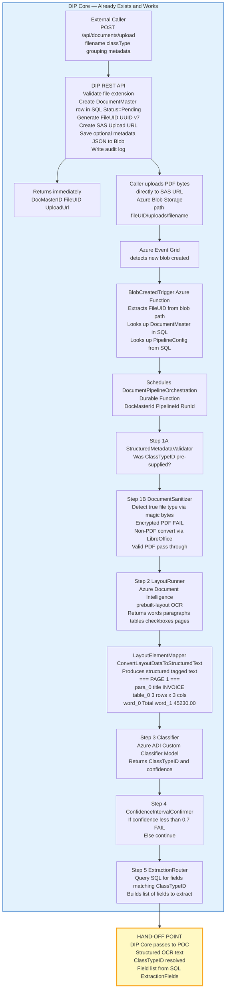

**What DIP Core gives the POC at the hand-off point:**
- The structured tagged text output from `LayoutElementMapper` (full OCR of the document)
- The `ClassTypeID` (which document type it is)
- The list of `ExtractionFields` from SQL for that `ClassTypeID` (field names, descriptions, types, prompt text)
- The blob path to the original PDF (for vision mode if needed)

---

## 2. The Integration Point

This diagram shows **exactly** where the POC plugs into DIP Core. Everything above the red line is DIP Core. Everything below is the POC.

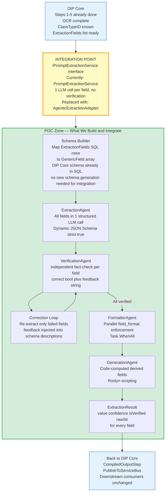

---

## 3. What the POC Brings

This is the **complete capability delta** — what does not exist today in DIP Core and what the POC adds.

| Capability | DIP Core Today | POC Adds |
|-----------|---------------|---------|
| **LLM calls per document** | N calls — 1 per field | 1 call for ALL fields (batched structured output) |
| **Schema generation from samples** | Manual SQL config only | LLM analyzes sample docs + user prompt → auto-generates field schema (3-call pattern matching DocuFlow) |
| **Validation rules (design-time)** | None | SchemaValidationAgent generates business rules (e.g. "amount > 0") applied after extraction — Call 4c |
| **Structured output enforcement** | Raw string parsing, any shape | `strict: true` JSON Schema — exact types, no hallucinated fields |
| **Verification** | None — hallucinations pass through | VerificationAgent: independent fact-check, `{correct, feedback}` per field |
| **Self-correction loop** | None | Re-extract only failed fields with verifier feedback injected |
| **Format enforcement** | Manual post-processing | FormatterAgent: `YYYY-MM-DD`, `2dp`, `UPPERCASE` etc — parallel |
| **Computed/generated fields** | None | GenerationAgent: Roslyn code execution for sums, date diffs, derived values |
| **Field confidence score** | None — value or nothing | 0–100 confidence per field, `isVerified` flag |
| **Vision per field** | Separate service, not integrated | Optional `UseVisionExtraction` flag per field in schema |

**What the POC does NOT touch in DIP Core:**
- Upload API and SAS URL generation
- Azure Event Grid triggering
- DocumentSanitizer / LibreOffice conversion
- LayoutRunner / Azure ADI prebuilt-layout OCR
- LayoutElementMapper (reused as-is)
- Custom Classifier model
- FormExtraction (Azure Form Recognizer) — this runs in parallel, untouched
- CompiledOutputStep — same input shape, unchanged
- PublishToServiceBus — completely unchanged
- All downstream consumers — completely unchanged

---

## 4. Complete POC Flow — Phases 3 to 9

This is the **master sequence diagram** for the full POC — matching DocuFlow Phases 3 through 9. The grey box at the top is DIP Core context (already exists); the green box is what the POC builds.

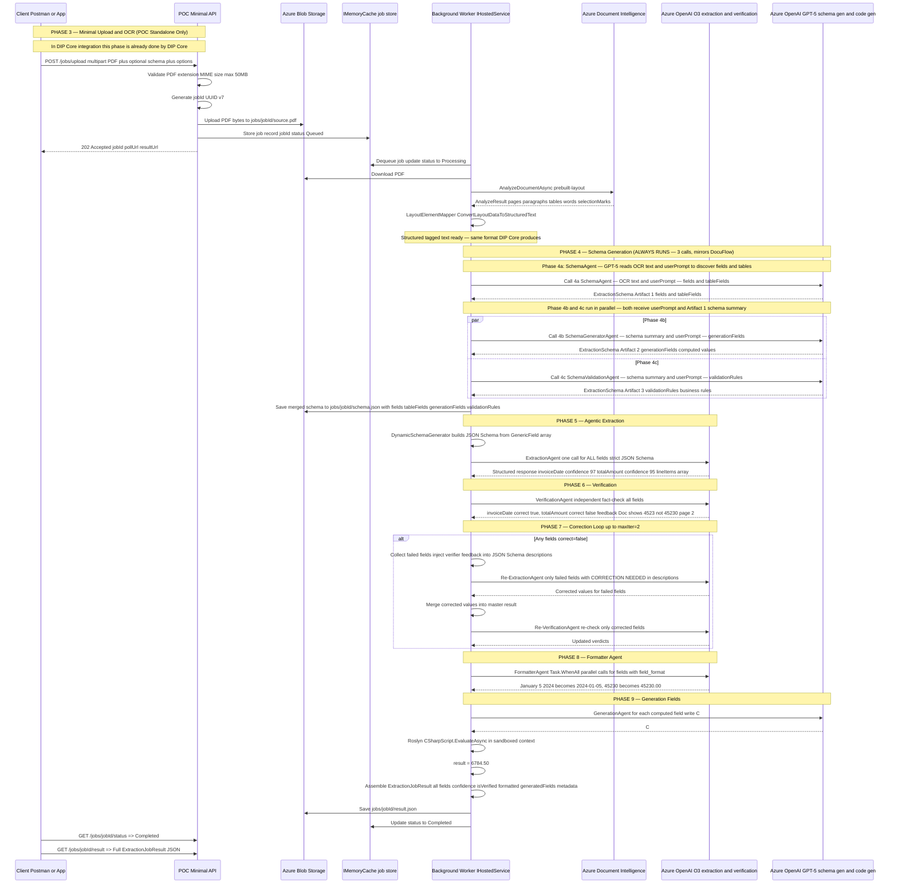

---

## 5. Phase 3 — Minimal Upload & OCR (POC Standalone Only)

> **Note:** This phase exists in the POC **only so it can run standalone without DIP Core**. When integrated into DIP Core, this entire phase is replaced by DIP Core's existing upload → Event Grid → LayoutRunner → LayoutElementMapper pipeline. The OCR output format is **identical** in both paths.

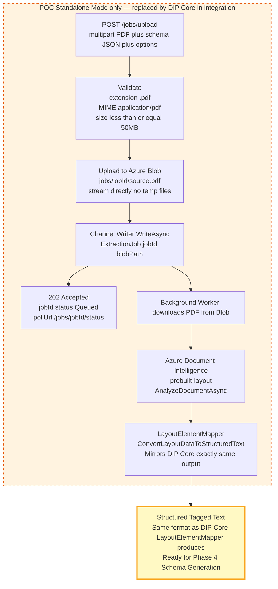

**100+ page document handling** (same as DIP Core):
- PDFs over 100 pages are split into 100-page chunks via `PdfSplitterService`
- Each chunk is analyzed by ADI in parallel
- Results are merged with correct page number offsets before passing to agents

---

## 6. Phase 4 — Schema Generation

> **This is a new capability that does not exist in DIP Core.** DIP Core requires field schemas to be manually configured in SQL per `ClassTypeID`. The POC adds the ability to **auto-generate the extraction schema** by giving the LLM sample documents and a plain-English description of what to extract.

**How schema generation works in the POC (3-call pattern — mirrors DocuFlow):**

The user uploads a PDF and provides a `userPrompt` describing what they want to extract (e.g. "Extract all invoice fields including vendor, dates, amounts and line items"). The system automatically runs **3 sequential/parallel GPT-5 calls**:

1. **Call 4a — SchemaAgent** (`SchemaGenSystemPrompt`): receives OCR text + userPrompt → discovers all directly-extractable fields and tables → produces `fields` + `tableFields` (Artifact 1)
2. **Call 4b — SchemaGeneratorAgent** (`SchemaGenGenerationFieldsSystemPrompt`): receives Artifact 1 schema summary + userPrompt → identifies derived/computed fields → produces `generationFields` (Artifact 2)
3. **Call 4c — SchemaValidationAgent** (`SchemaValidationSystemPrompt`): receives Artifact 1 schema summary + userPrompt → generates business validation rules → produces `validationRules` (Artifact 3)

Calls 4b and 4c run in **parallel** (`Task.WhenAll`) since both only need Artifact 1 output. The raw OCR text is only sent to Call 4a — Calls 4b/4c receive a compact schema summary instead.

All three artifacts are merged into the final `ExtractionSchema` used by Phases 5–9.

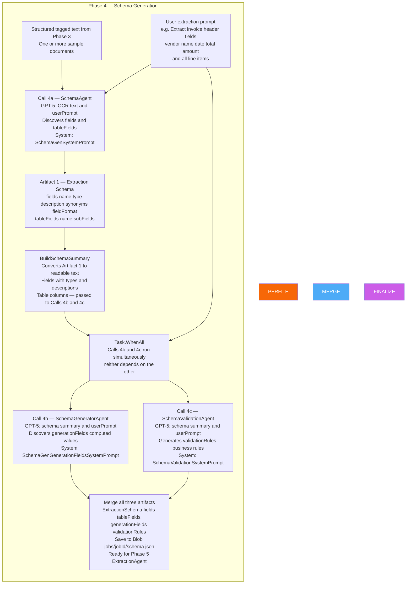

**Schema output structure:**

```json
{
  "fields": [
    {
      "name": "invoiceDate",
      "type": "date",
      "description": "The date the invoice was issued",
      "synonyms": ["Invoice Date", "Bill Date", "Date of Issue"],
      "fieldFormat": "YYYY-MM-DD"
    },
    {
      "name": "totalAmount",
      "type": "number",
      "description": "Total amount due on the invoice",
      "synonyms": ["Total", "Grand Total", "Amount Due", "Total Due"]
    },
    {
      "name": "vendorName",
      "type": "string",
      "description": "Name of the vendor or supplier",
      "synonyms": ["Vendor", "Supplier", "From", "Bill From"]
    }
  ],
  "tableFields": [
    {
      "name": "lineItems",
      "description": "Invoice line items",
      "synonyms": ["Items", "Services Rendered", "Description of Charges"],
      "subFields": [
        { "name": "description", "type": "string" },
        { "name": "quantity",    "type": "integer" },
        { "name": "unitPrice",   "type": "number" },
        { "name": "lineTotal",   "type": "number" }
      ]
    }
  ],
  "generationFields": [
    {
      "name": "totalTax",
      "type": "number",
      "fieldFormat": "2dp",
      "instructions": "Compute total tax as totalAmount * 0.15"
    },
    {
      "name": "daysSinceIssue",
      "type": "integer",
      "instructions": "Number of days between invoiceDate and today"
    }
  ],
  "validationRules": [
    {
      "fieldName": "totalAmount",
      "condition": "must be greater than 0",
      "errorMessage": "Invoice total must be a positive number",
      "severity": "Error"
    },
    {
      "fieldName": "invoiceDate",
      "condition": "must be a date in the past or today",
      "errorMessage": "Invoice date cannot be in the future",
      "severity": "Warning"
    },
    {
      "fieldName": "vendorName",
      "condition": "must not be empty",
      "errorMessage": "Vendor name is required",
      "severity": "Error"
    }
  ]
}
```

> **In the POC, schema generation ALWAYS runs — this IS the main feature.**
> When a user uploads a PDF and clicks "Generate Fields", the system OCRs the document and sends the structured text to an LLM (GPT-5) which automatically discovers every extractable field. No manual SQL configuration. No pre-defined schema. The LLM tells you what's in the document.

**POC primary flow — schema generation is Step 1:**
```
POST /jobs/upload (PDF + userPrompt)
  → OCR with ADI prebuilt-layout
  → Schema Generation (GPT-5 discovers fields automatically)
  → ExtractionAgent (O3 extracts all fields in one call)
  → VerificationAgent (O3 fact-checks each extracted value)
  → Correction Loop (re-extract failed fields with verifier feedback injected)
  → FormatterAgent (apply field_format in parallel)
  → GenerationAgent (Roslyn executes computed field expressions)
  → Result: { fields, tableFields, generatedFields, metadata }
```

> **DIP Core integration is a post-POC concern.** Once the POC proves the pipeline works end-to-end, integration with DIP Core's `IPromptExtractionService` will be planned separately. For now, build and validate the standalone POC.

---

## 7. Phase 5 — Agentic Extraction

> **This replaces DIP Core's `PromptExtractionService` — 1 LLM call per field — with a single structured call for ALL fields simultaneously.**

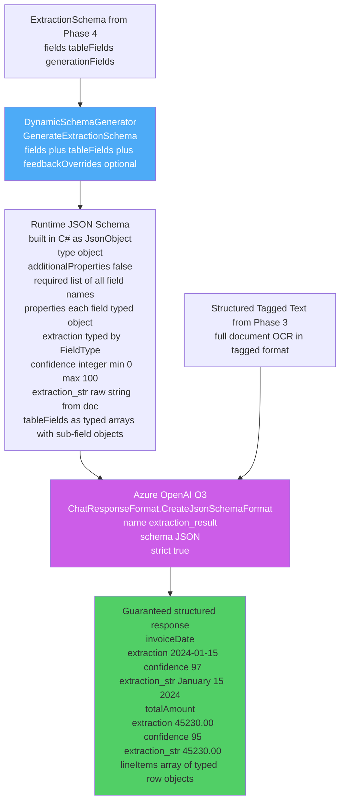

**C# implementation sketch:**

```csharp
public class ExtractionAgent
{
    public async Task<ExtractionResult> ExtractFieldsAsync(
        ExtractionSchema schema,
        string structuredText,
        Dictionary<string, string>? feedbackOverrides = null)
    {
        // Build JSON Schema at runtime from field definitions
        // feedbackOverrides = verifier feedback injected per field description on re-extraction pass
        var jsonSchema = DynamicSchemaGenerator.GenerateExtractionSchema(
            schema.Fields, schema.TableFields, feedbackOverrides);

        var responseFormat = ChatResponseFormat.CreateJsonSchemaFormat(
            jsonSchemaFormatName: "extraction_result",
            jsonSchema: BinaryData.FromString(jsonSchema.ToJsonString()),
            jsonSchemaIsStrict: true);

        var messages = new List<ChatMessage>
        {
            new SystemChatMessage(SystemPrompts.ExtractorSystemPrompt),
            new UserChatMessage(structuredText)
        };

        // Optional: add PDF page images for vision-enabled fields
        if (schema.Fields.Any(f => f.UseVisionExtraction) && pageImages?.Any() == true)
            foreach (var img in pageImages)
                messages.Add(new UserChatMessage(ChatMessageContentPart.CreateImagePart(img, "image/png")));

        var response = await _chatClient.CompleteChatAsync(messages,
            new ChatCompletionOptions { ResponseFormat = responseFormat });

        return ParseExtractionResponse(response.Value.Content[0].Text, schema);
    }
}
```

---

## 8. Phase 6 — Verification

> **New capability — does not exist in DIP Core.** An independent LLM call fact-checks every extracted value against the source document before results are saved.

**Why independent and not "check your work" in the same call?** A single LLM call exhibits confirmation bias — it tends to validate what it just said. A separate call with a skeptical system prompt ("You are a fact-checker. Be critical.") consistently catches a different class of errors. This is the same reason legal firms use independent auditors.

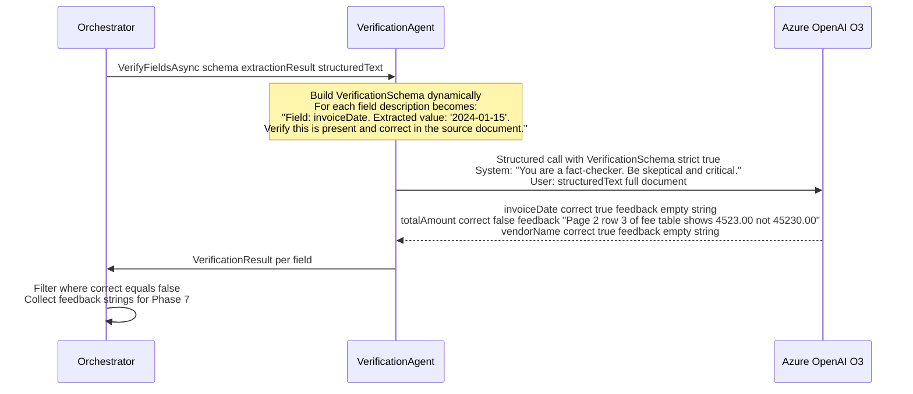

**VerificationSchema (dynamically generated per call):**

```json
{
  "type": "object",
  "additionalProperties": false,
  "required": ["invoiceDate", "totalAmount", "vendorName"],
  "properties": {
    "invoiceDate": {
      "type": "object",
      "description": "Field: invoiceDate. Extracted value: '2024-01-15'. Verify this is present and correct.",
      "additionalProperties": false,
      "required": ["correct", "feedback"],
      "properties": {
        "correct":  { "type": "boolean" },
        "feedback": { "type": "string",
                      "description": "If incorrect, state the right value and where in the document it appears" }
      }
    }
  }
}
```

---

## 9. Phase 7 — Correction Loop

> **New capability — does not exist in DIP Core.** Incorrect fields are re-extracted with the verifier's feedback injected directly into the JSON Schema field descriptions. Bounded to `maxIter` iterations (default: 2).

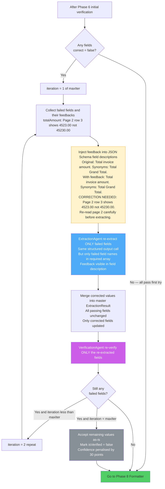

---

## 10. Phase 8 — Formatter Agent

> **New capability — does not exist in DIP Core.** Fields that have a `fieldFormat` instruction are transformed in parallel. All format calls run concurrently via `Task.WhenAll` — no sequential blocking.

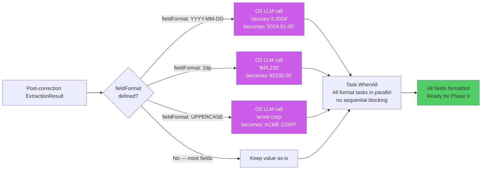

---

## 11. Phase 9 — Generation Fields

> **New capability — does not exist in DIP Core.** Fields that cannot be extracted (because they are derived from other extracted values) are computed by generating and executing C# code via Roslyn scripting. Deterministic — no LLM arithmetic.

```mermaid
flowchart TD
    SCHEMA_GEN["generationFields from schema\ntotalTax: Compute totalAmount times 0.15\ndaysSinceIssue: days between invoiceDate and today\nisHighValue: totalAmount greater than 100000"]

    SCHEMA_GEN --> FOREACH["For each GenerationField in sequence"]

    FOREACH --> CODEGEN["GPT-5 LLM call\nPrompt: Write a single C# expression to compute:\nfield.instructions\nAvailable data: extractionResult.Fields as JSON\nReturn ONLY the expression no method wrapper"]

    CODEGEN --> CODE["Generated C# expression example\nData[\"totalAmount\"].GetDouble() * 0.15"]

    CODE --> SAFETY["Safety check\nRegex whitelist scan\nReject if contains: File. Process.\nHttpClient Assembly. Type.GetType\nEnvironment. Console. Thread."]

    SAFETY -->|"Unsafe"| SKIP["result = null\nlog warning isGenerated = false"]
    SAFETY -->|"Safe"| ROSLYN["Roslyn CSharpScript.EvaluateAsync\nScriptOptions\n  AddImports System System.Linq System.Math\n  NO file system no network no reflection\nglobals: ScriptGlobals { Data = extractionFields }"]

    ROSLYN -->|"CompilationError or runtime exception"| FAIL["result = null\nlog error isGenerated = false"]
    ROSLYN -->|"Success"| RESULT["result = 6784.50"]

    RESULT --> FINAL_GEN["generatedFields\n  totalTax: 6784.50\n  daysSinceIssue: 172\n  isHighValue: false"]
    FAIL --> FINAL_GEN
    SKIP --> FINAL_GEN

    FINAL_GEN --> ASSEMBLE["Assemble final ExtractionJobResult\nfields + tableFields + generatedFields + metadata\nSave to Blob jobs/jobId/result.json\nUpdate status to Completed"]

    style CODEGEN fill:#f76707,color:#fff
    style ROSLYN fill:#51cf66,color:#333
    style SAFETY fill:#fff3cd,stroke:#f9a825
    style SKIP fill:#f8d7da,stroke:#dc3545
```

**Final output shape:**

```json
{
  "jobId": "01926f3a-...",
  "status": "Completed",
  "fields": {
    "invoiceDate":  { "value": "2024-01-15", "confidence": 97, "isVerified": true,  "rawStr": "January 15, 2024" },
    "totalAmount":  { "value": 4523.00,       "confidence": 88, "isVerified": true,  "rawStr": "$4,523.00" },
    "vendorName":   { "value": "Acme Corp",   "confidence": 99, "isVerified": true,  "rawStr": "ACME CORPORATION" }
  },
  "tableFields": {
    "lineItems": [
      { "description": "Software License", "quantity": 1, "unitPrice": 40000.00, "lineTotal": 40000.00 },
      { "description": "Support Fee",      "quantity": 1, "unitPrice": 5230.00,  "lineTotal": 5230.00  }
    ]
  },
  "generatedFields": {
    "totalTax": 6784.50,
    "daysSinceIssue": 172,
    "isHighValue": false
  },
  "metadata": {
    "schemaWasAutoGenerated": false,
    "llmCallCount": 5,
    "correctionIterations": 1,
    "processingTimeMs": 8340,
    "ocrPageCount": 3
  }
}
```

---

## 12. Dynamic JSON Schema — The Core Mechanism

Everything in Phase 5, 6, and 7 depends on this. The `DynamicSchemaGenerator` converts user-defined `GenericField` objects into a strict JSON Schema at runtime. This schema is passed to Azure OpenAI with `strict: true` — which means the LLM **must** return exactly that shape. No extra fields, no missing fields, no wrong types.

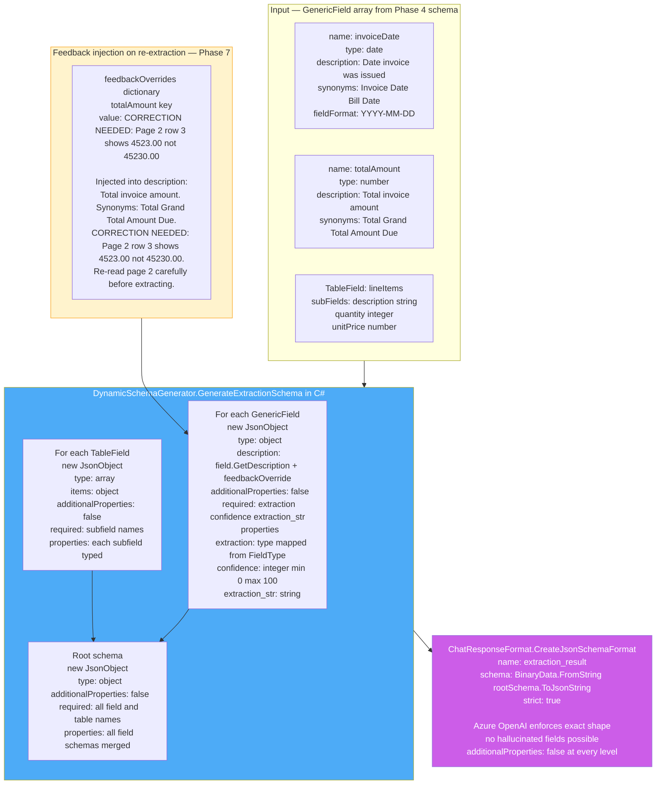

---

## 13. How Phases 5–9 Integrate Into DIP Core

Only **Phases 5–9** (ExtractionAgent, VerificationAgent, Correction Loop, FormatterAgent, GenerationAgent) are integrated into DIP Core. Phases 3 and 4 are POC-only concerns.

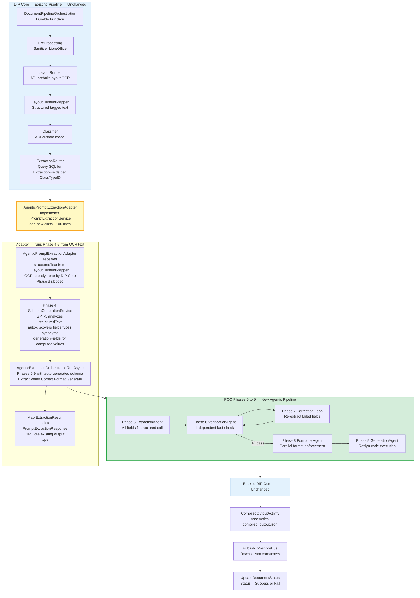

**How to swap in the adapter — one line change in DIP Core DI registration:**

```csharp
// Before (DIP Core current)
services.AddScoped<IPromptExtractionService, PromptExtractionService>();

// After (POC integrated)
services.AddScoped<IPromptExtractionService, AgenticPromptExtractionAdapter>();
// AgenticPromptExtractionAdapter wraps AgenticExtractionOrchestrator internally
// PromptExtractionActivity, DocumentPipelineOrchestration — completely unchanged
```

---

## 14. Technology Stack

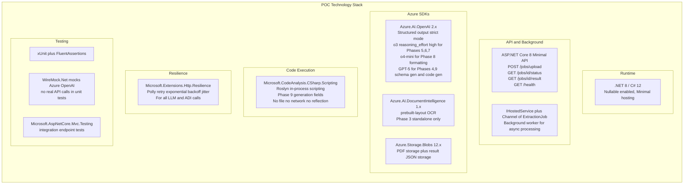

---

## 15. POC Project Structure

```
DIP.AgenticExtraction.Poc/                    outside dip-core repo
|
+-- src/
|   +-- DIP.AgenticExtraction.Poc/
|       |
|       +-- Program.cs                        Minimal API + DI + Channel<ExtractionJob>
|       |
|       +-- Endpoints/
|       |   +-- ExtractionEndpoints.cs        POST /jobs/upload, GET status, GET result
|       |
|       +-- Models/
|       |   +-- ExtractionSchema.cs           GenericField, TableField, GenerationField
|       |   +-- ExtractionJobResult.cs        ExtractionFieldResult, JobStatus enum
|       |   +-- VerificationResult.cs         correct bool, feedback string per field
|       |   +-- OcrContext.cs                 StructuredText + raw ADI result
|       |
|       +-- Schema/
|       |   +-- DynamicSchemaGenerator.cs     Phase 5/6/7 core — builds JSON Schema at runtime
|       |   +-- SchemaGenerationService.cs    Phase 4 — LLM generates schema from sample docs
|       |   +-- DipCoreSchemaMapper.cs        Maps SQL ExtractionFields to GenericField[]
|       |
|       +-- Agents/                           Phases 5-9
|       |   +-- ExtractionAgent.cs            Phase 5 — structured extraction
|       |   +-- VerificationAgent.cs          Phase 6 — independent fact-check
|       |   +-- FormatterAgent.cs             Phase 8 — parallel field_format
|       |   +-- GenerationAgent.cs            Phase 9 — Roslyn code execution
|       |
|       +-- Orchestration/
|       |   +-- AgenticExtractionOrchestrator.cs  Phases 5-9 loop controller
|       |   +-- ExtractionJobProcessor.cs         IHostedService — runs full Phase 3-9 pipeline
|       |   +-- ExtractionJob.cs                  jobId, blobPath, schema, status
|       |
|       +-- Services/
|       |   +-- OcrPreprocessingService.cs    Phase 3 — ADI call (standalone only)
|       |   +-- LayoutElementMapper.cs        Phase 3 — mirrors DIP Core exactly
|       |   +-- AzureOpenAIClientFactory.cs   O3 o4-mini GPT-5 clients
|       |   +-- BlobStorageService.cs         PDF upload and result JSON storage
|       |   +-- JobStore.cs                   IMemoryCache wrapper for job tracking
|       |
|       +-- Prompts/
|       |   +-- SystemPrompts.cs              Extractor, Verifier, Formatter, SchemaGen prompts
|       |
|       +-- Options/
|           +-- AgenticExtractionOptions.cs   maxIter, models, thresholds, maxFileSizeMb
|
+-- tests/
|   +-- DIP.AgenticExtraction.Poc.Tests/
|       +-- Unit/
|       |   +-- DynamicSchemaGeneratorTests.cs
|       |   +-- ExtractionAgentTests.cs          WireMock mocks OpenAI response
|       |   +-- VerificationAgentTests.cs
|       |   +-- FormatterAgentTests.cs
|       |   +-- GenerationAgentTests.cs          Roslyn execution tests
|       |   +-- CorrectionLoopTests.cs           Tests iteration count and merge logic
|       |   +-- SchemaGenerationServiceTests.cs
|       +-- Integration/
|           +-- FullPipelineTests.cs             Phase 3-9 with real PDF and WireMock for LLM
|
+-- samples/
|   +-- schema-subscription-form.json        Mirrors DIP Core ClassTypeID=7 ExtractionFields
|   +-- schema-invoice.json
|   +-- test-invoice.pdf
|   +-- test-subscription.pdf
|
+-- DIP.AgenticExtraction.Poc.sln
```

---

## 16. Implementation Timeline

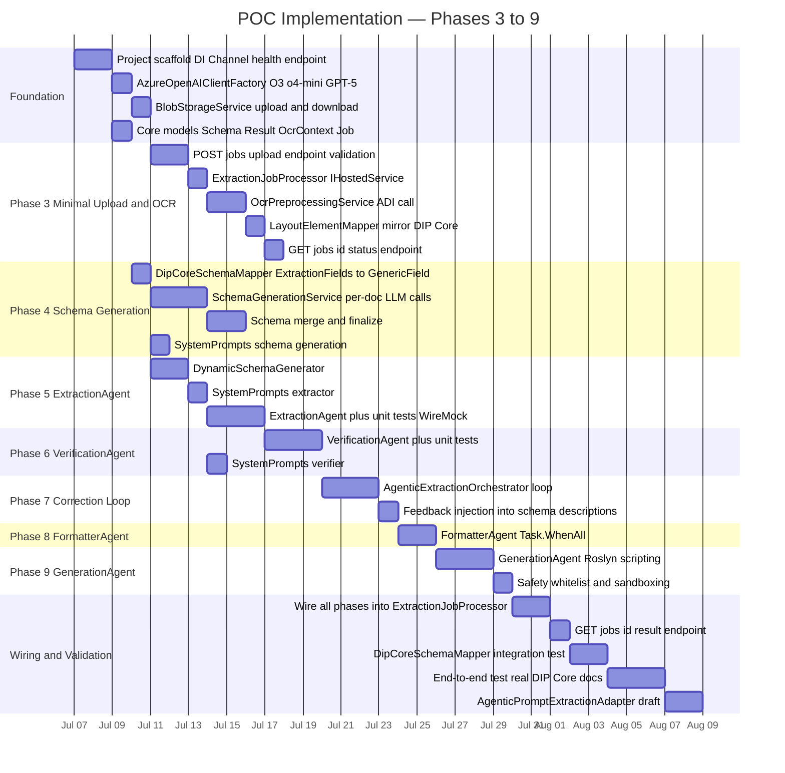

---

## 17. Decision Log

| Decision | Chosen | Alternatives | Reasoning |
|----------|--------|-------------|-----------|
| **Schema generation included in POC** | Yes — Phase 4, auto-generate from sample docs | Skip — require manual schema JSON | DocuFlow Phase 5 is a core differentiator. Without it the POC cannot show the full end-to-end capability. DIP Core integration uses pass-through from SQL. |
| **All fields in one extraction call** | Single structured O3 call | 1 call per field (DIP Core current) | Batching keeps document context consistent across fields. Reduces LLM calls from N to 1. Structured output enforces exact types. |
| **Independent verifier call** | Separate O3 call with skeptical system prompt | Same call "check your work" | Confirmation bias in self-review. Independent call with different system prompt catches a different error class. |
| **Feedback injected into JSON Schema description** | `description` field per property | Separate message entry per field, system prompt append | `strict: true` JSON Schema does not allow extra keys. `description` is the only per-field metadata channel in the JSON Schema specification. |
| **Roslyn for generation fields** | `CSharpScript.EvaluateAsync` in-process | Python subprocess, Azure Functions, Container Jobs | Zero extra infrastructure. In-process execution. Sandboxable via ScriptOptions. Python subprocess adds cross-language boundary. |
| **Minimal Phase 3 in POC** | Include for standalone demo | Omit — require DIP Core to provide OCR | POC must be runnable independently for demo and validation. In integration, Phase 3 is skipped — DIP Core provides the structured text directly. |
| **`Channel<T>` + `IHostedService`** | In-process background worker | Azure Functions, Azure Queue | Zero extra infrastructure. Idiomatic .NET 8. Easy to swap to Azure Queue Storage later with one change. |
| **`additionalProperties: false` everywhere** | Every nested JSON Schema object | Root only | Azure OpenAI `strict: true` requires it at every level. Missing at any level causes the API to reject the schema. |

---

## 18. Risk Register

| Risk | Likelihood | Impact | Mitigation |
|------|-----------|--------|------------|
| **Verifier confirms extractor** (confirmation bias) | Medium | High | Different temperatures: extractor 0.0, verifier 0.2. Use GPT-5 for schema gen vs O3 for extraction to introduce model diversity. |
| **Token limit exceeded** on large documents | High | Medium | Split OCR text into page-range windows (mirrors DIP Core's `BatchExtractionService`). Run extraction per window and merge results. |
| **Roslyn code security** | Low | High | `ScriptOptions` — no file, no network, no reflection imports. Regex whitelist rejects: `File.`, `Process.`, `HttpClient`, `Assembly.`, `Environment.`, `Console.` |
| **O3 rate limits** at POC scale | Medium | Medium | `AddResilienceHandler` with exponential backoff and jitter. Fallback to GPT-5 if O3 quota exhausted. |
| **Latency increase** (3+ calls vs 1 per field) | High | Medium | 3 calls replaces N-per-field. For N greater than 6 fields, POC is already faster. Document trade-off for smaller field counts. |
| **DIP Core `PromptExtractionResponse` mapping gaps** | Low | High | `AgenticPromptExtractionAdapter` maps field-by-field. Unit tested against real DIP Core model types from the start. |
| **Schema generation produces unusable schema** | Medium | Medium | Validate generated schema with `DynamicSchemaGenerator` before first extraction call. Log and fall back to manual schema if validation fails. |
| **`strict: true` rejecting valid LLM output** | Medium | Low | Always set `additionalProperties: false` at every nested level. Run schema through Azure OpenAI Playground to validate before use. |

---

## 19. Success Criteria

| Criterion | How measured | Target |
|-----------|-------------|--------|
| **Phases 3–9 run end-to-end** | POST /jobs/upload → GET /jobs/id/result succeeds | For PDF invoice, subscription form, fund statement |
| **Schema generation works** | Auto-generate schema from 3 sample docs without manual intervention | Schema contains correct field names and types |
| **Extraction accuracy** | Manual validation on 20 known-answer documents | 95% or greater field-level accuracy |
| **Verification catches errors** | Inject deliberate wrong values in test set | 80% or greater caught before final result |
| **Self-correction works** | At least 1 documented case where verifier caught error and re-extraction fixed it | Demonstrated on real document |
| **LLM call efficiency** | Count calls per N-field document | 3–5 calls regardless of N |
| **Format enforcement** | Fields with `fieldFormat` spec | 100% match spec |
| **Generation fields compute correctly** | `totalTax`, `daysSinceIssue` compared to manually computed values | 100% correct for arithmetic |
| **DIP Core adapter maps correctly** | Unit tests against real `PromptExtractionResponse` type | 0 null mapping failures |
| **P50 latency** | Wall-clock time for 15-field 5-page document | 15 seconds or less |

---

## 20. Full Comparison

| Step | DIP Core Already Has | DocuFlow Has | POC Adds |
|------|---------------------|--------------|---------|
| **Upload** | SAS URL client uploads directly | POST /file-process/upload | POST /jobs/upload for standalone demo |
| **Pipeline trigger** | Azure Event Grid | FastAPI background task | IHostedService Channel of T |
| **Pre-processing sanitizer** | DocumentSanitizer LibreOffice | File type detection | Not rebuilt — DIP Core handles |
| **OCR** | ADI prebuilt-layout LayoutRunner | ADI or Mistral OCR | ADI prebuilt-layout for standalone |
| **Structured text conversion** | LayoutElementMapper | OCR Markdown | LayoutElementMapper mirror of DIP Core |
| **Classification** | ADI custom classifier | Category classification | Not rebuilt — DIP Core handles |
| **Schema generation** | Manual SQL config only | LLM auto-generates from samples | YES — Phase 4 new capability |
| **Extraction** | 1 LLM call per field no structure | 1 structured call all fields | YES — Phase 5 ExtractionAgent |
| **Verification** | None | VerificationAgent | YES — Phase 6 new capability |
| **Correction loop** | None | Up to maxIter iterations | YES — Phase 7 new capability |
| **Format enforcement** | None manual post-process | FormatterAgent parallel | YES — Phase 8 new capability |
| **Computed fields** | None | AutoGen code execution | YES — Phase 9 Roslyn scripting |
| **Field confidence** | None | 0-100 per field | YES — every field carries confidence |
| **Verified flag** | None | Not explicit | YES — isVerified bool per field |
| **Output assembly** | CompiledOutputActivity unchanged | Inference collection | Feeds back to DIP Core CompiledOutputActivity |
| **Service Bus publish** | PublishToServiceBus unchanged | MCP actions | DIP Core handles unchanged |
