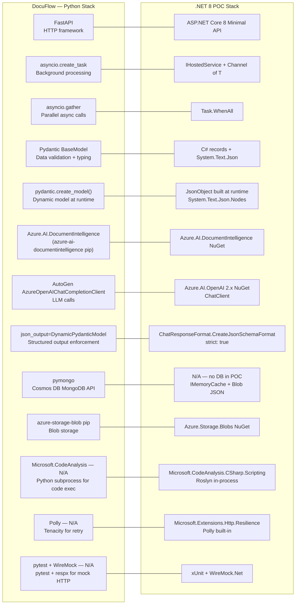
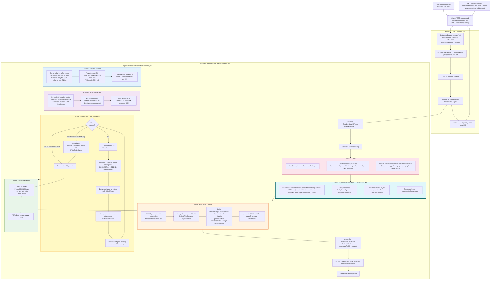

# POC Implementation Guide: Agentic Extraction & Field Generation
### Complete Step-by-Step — Upload to Generated Fields — .NET 8

> This document is the **implementation reference** for the POC. It covers every class, every file, every decision, and every line of meaningful code — from the moment a PDF is received to the moment verified, formatted, and computed fields are returned. The companion planning document (`POC_AGENTIC_EXTRACTION_PLAN.md`) explains the _why_. This document explains the _how_.

---

## POC vs DIP Core Integration — How This Fits Together

This is the single most important concept to understand before reading any implementation details.

### POC (Standalone — What We Are Building Now)

```
POST /jobs/upload (PDF + userPrompt)
        │
        ▼
  ┌─────────────────────────────────────────────────────────┐
  │  Phase 3 — OCR (ADI prebuilt-layout)                    │
  │  ↑ THIS IS TEST HARNESS ONLY — exists so the POC runs   │
  │    standalone without needing DIP Core to be running    │
  └──────────────────────────┬──────────────────────────────┘
                             │  structured tagged text
                             ▼
  ┌─────────────────────────────────────────────────────────┐
  │  Phase 4 — Schema Generation  ← THE MAIN FEATURE        │
  │  GPT-5 reads the OCR text + userPrompt                  │
  │  Auto-discovers: field names, types, synonyms, formats  │
  │  Also identifies computed/derived generation fields     │
  └──────────────────────────┬──────────────────────────────┘
                             │  ExtractionSchema
                             ▼
  ┌─────────────────────────────────────────────────────────┐
  │  Phase 5 → Extract  (O3, one call, all fields)          │
  │  Phase 6 → Verify   (O3, independent fact-check)        │
  │  Phase 7 → Correct  (re-extract failed fields)          │
  │  Phase 8 → Format   (enforce field_format in parallel)  │
  │  Phase 9 → Generate (Roslyn executes computed fields)   │
  └──────────────────────────┬──────────────────────────────┘
                             │
                             ▼
              GET /jobs/{id}/result  →  ExtractionJobResult JSON
```

### DIP Core (After Integration — Post-POC)

```
Upload → EventGrid → Sanitizer → ADI OCR → LayoutElementMapper
                                                    │
                                         structured tagged text
                                         (DIP Core already produces this)
                                                    │
                                    ┌───────────────▼───────────────┐
                                    │  Phase 4 — Schema Generation   │
                                    │  (plugs in HERE via adapter)   │
                                    │                                │
                                    │  Phase 5 → Extract             │
                                    │  Phase 6 → Verify              │
                                    │  Phase 7 → Correct             │
                                    │  Phase 8 → Format              │
                                    │  Phase 9 → Generate            │
                                    └───────────────┬───────────────┘
                                                    │
                                          CompiledOutput → ServiceBus
                                          (DIP Core downstream unchanged)
```

**Key point:** When integrating, Phase 3 (OCR) is dropped entirely — DIP Core's `LayoutElementMapper` already produces the exact same structured tagged text the POC uses. The adapter plugs in after `LayoutElementMapper` and runs Phase 4 onwards.

---

## Table of Contents

1. [Framework Comparison: Python (DocuFlow) to .NET (POC)](#1-framework-comparison)
2. [Complete File Structure](#2-complete-file-structure)
3. [Step 1 — Project Setup & Dependencies](#3-step-1--project-setup--dependencies)
4. [Step 2 — Core Models](#4-step-2--core-models)
5. [Step 3 — Azure Service Clients & Options](#5-step-3--azure-service-clients--options)
6. [Step 4 — Upload Endpoint & Job Store](#6-step-4--upload-endpoint--job-store)
7. [Step 5 — OCR & LayoutElementMapper](#7-step-5--ocr--layoutelementmapper)
8. [Step 6 — Schema Generation](#8-step-6--schema-generation)
9. [Step 7 — Dynamic JSON Schema Builder](#9-step-7--dynamic-json-schema-builder)
10. [Step 8 — ExtractionAgent](#10-step-8--extractionagent)
11. [Step 9 — VerificationAgent](#11-step-9--verificationagent)
12. [Step 10 — Correction Loop Orchestrator](#12-step-10--correction-loop-orchestrator)
13. [Step 11 — FormatterAgent](#13-step-11--formatteragent)
14. [Step 12 — GenerationAgent (Roslyn)](#14-step-12--generationagent)
15. [Step 13 — Output Assembly & Result Endpoint](#15-step-13--output-assembly--result-endpoint)
16. [Step 14 — Background Job Processor](#16-step-14--background-job-processor)
17. [Step 15 — System Prompts](#17-step-15--system-prompts)
18. [Step 16 — Program.cs Wiring](#18-step-16--programcs-wiring)
19. [Step 17 — Unit Tests](#19-step-17--unit-tests)
20. [Complete Continuous Flow Diagram](#20-complete-continuous-flow)
21. [API Contract Reference](#21-api-contract-reference)
22. [Configuration Reference](#22-configuration-reference)

---

## 1. Framework Comparison

Every Python component in DocuFlow has an exact .NET equivalent. This table maps every file, library, and pattern.



### Pattern-by-Pattern Mapping

| DocuFlow Python Pattern | .NET 8 POC Equivalent | Notes |
|------------------------|----------------------|-------|
| `FastAPI @router.post("/upload")` | `app.MapPost("/jobs/upload", handler)` | Minimal API — no controller class |
| `asyncio.create_task(inference_task(...))` | `Channel<ExtractionJob>.Writer.WriteAsync(job)` | IHostedService reads and processes |
| `asyncio.gather(*tasks)` | `await Task.WhenAll(tasks)` | Parallel async — identical semantics |
| `pydantic.create_model("M", **fields)` | `new JsonObject { ... }` built in C# | Runtime JSON Schema instead of runtime class |
| `json_output=DynamicModel` in AutoGen | `ChatResponseFormat.CreateJsonSchemaFormat(schema, strict: true)` | Azure OpenAI enforces exact shape |
| `class ExtractionModel(BaseModel): field: ExtractionFielddate` | JSON Schema `{ type: object, properties: { extraction: {type:string}, confidence: {type:integer} } }` | Same constraint, different mechanism |
| `VerificationResult(correct=True, feedback="")` | `JsonElement` parsed to `VerificationFieldResult` record | Deserialized from strict JSON Schema response |
| `await asyncio.gather(*[process_doc(d) for d in docs])` | `await Task.WhenAll(docs.Select(d => ProcessDocAsync(d)))` | Exact parallel equivalent |
| `CSharpScript.EvaluateAsync` — N/A in Python | `Microsoft.CodeAnalysis.CSharp.Scripting` | Python uses AutoGen + subprocess for code exec |
| `inference_collection.update_one(...)` | `BlobStorageService.SaveJsonAsync(jobId, result)` | POC uses Blob instead of Cosmos — no DB needed |
| `fileprocess_collection.find_one({"_id": id})` | `JobStore.GetJob(jobId)` via IMemoryCache | POC uses in-memory — swap to Redis/SQL for prod |
| `@router.get("/inference/{file_process_id}/{blob_path}")` | `app.MapGet("/jobs/{id}/result", handler)` | Same REST pattern, Minimal API style |
| `tenacity.retry(stop=stop_after_attempt(3))` | `AddResilienceHandler` with Polly pipeline | Built into `Microsoft.Extensions.Http.Resilience` |

---

## 2. Complete File Structure

```
DIP.AgenticExtraction.Poc/
|
+-- DIP.AgenticExtraction.Poc.sln
|
+-- src/
|   +-- DIP.AgenticExtraction.Poc/
|       +-- DIP.AgenticExtraction.Poc.csproj
|       +-- Program.cs                              Step 16 — wires everything together
|       |
|       +-- Models/
|       |   +-- ExtractionSchema.cs                Step 2 — GenericField, TableField, GenerationField
|       |   +-- ExtractionJobResult.cs             Step 2 — ExtractionFieldResult, ExtractionJobResult
|       |   +-- VerificationResult.cs              Step 2 — VerificationFieldResult
|       |   +-- OcrContext.cs                      Step 2 — structured text + page images
|       |   +-- ExtractionJob.cs                   Step 2 — job envelope for Channel<T>
|       |
|       +-- Options/
|       |   +-- AgenticExtractionOptions.cs        Step 3 — config binding
|       |   +-- OpenAIModelOptions.cs              Step 3 — per-model config
|       |
|       +-- Services/
|       |   +-- AzureOpenAIClientFactory.cs        Step 3 — creates ChatClient for O3, O4Mini and GPT-5
|       |   +-- BlobStorageService.cs              Step 3 — upload PDF, save/load JSON
|       |   +-- JobStore.cs                        Step 4 — IMemoryCache wrapper
|       |
|       +-- Endpoints/
|       |   +-- ExtractionEndpoints.cs             Step 4 — upload, status, result endpoints
|       |
|       +-- Ocr/
|       |   +-- OcrPreprocessingService.cs         Step 5 — ADI call + large doc splitting
|       |   +-- LayoutElementMapper.cs             Step 5 — ADI result to structured tagged text
|       |
|       +-- Schema/
|       |   +-- DynamicSchemaGenerator.cs          Step 7 — JsonObject JSON Schema at runtime
|       |   +-- SchemaGenerationService.cs         Step 6 — LLM generates schema from sample docs
|       |   +-- DipCoreSchemaMapper.cs             Step 6 — SQL ExtractionFields to GenericField[]
|       |
|       +-- Agents/
|       |   +-- ExtractionAgent.cs                 Step 8 — structured extraction all fields
|       |   +-- VerificationAgent.cs               Step 9 — independent fact-check
|       |   +-- FormatterAgent.cs                  Step 11 — parallel field_format enforcement
|       |   +-- GenerationAgent.cs                 Step 12 — Roslyn code execution
|       |
|       +-- Orchestration/
|       |   +-- AgenticExtractionOrchestrator.cs   Step 10 — Extract Verify Loop Format Generate
|       |   +-- ExtractionJobProcessor.cs          Step 14 — IHostedService dequeues and runs
|       |
|       +-- Prompts/
|           +-- SystemPrompts.cs                   Step 15 — all LLM system prompts
|
+-- tests/
    +-- DIP.AgenticExtraction.Poc.Tests/
        +-- DIP.AgenticExtraction.Poc.Tests.csproj
        +-- Unit/
        |   +-- DynamicSchemaGeneratorTests.cs
        |   +-- ExtractionAgentTests.cs
        |   +-- VerificationAgentTests.cs
        |   +-- FormatterAgentTests.cs
        |   +-- GenerationAgentTests.cs
        |   +-- CorrectionLoopTests.cs
        |   +-- SchemaGenerationTests.cs
        +-- Integration/
            +-- FullPipelineTests.cs
            +-- Helpers/
                +-- WireMockOpenAIServer.cs
```

---

## 3. Step 1 — Project Setup & Dependencies

### Create solution and project

```powershell
# Run from outside dip-core repo
mkdir DIP.AgenticExtraction.Poc
cd DIP.AgenticExtraction.Poc

dotnet new sln
dotnet new webapi --minimal -n DIP.AgenticExtraction.Poc -o src/DIP.AgenticExtraction.Poc
dotnet new xunit -n DIP.AgenticExtraction.Poc.Tests -o tests/DIP.AgenticExtraction.Poc.Tests

dotnet sln add src/DIP.AgenticExtraction.Poc
dotnet sln add tests/DIP.AgenticExtraction.Poc.Tests
dotnet add tests/DIP.AgenticExtraction.Poc.Tests reference src/DIP.AgenticExtraction.Poc
```

### `DIP.AgenticExtraction.Poc.csproj`

```xml
<Project Sdk="Microsoft.NET.Sdk.Web">
  <PropertyGroup>
    <TargetFramework>net8.0</TargetFramework>
    <Nullable>enable</Nullable>
    <ImplicitUsings>enable</ImplicitUsings>
    <RootNamespace>DIP.AgenticExtraction.Poc</RootNamespace>
    <AssemblyName>DIP.AgenticExtraction.Poc</AssemblyName>
  </PropertyGroup>

  <ItemGroup>
    <!-- Azure SDKs -->
    <PackageReference Include="Azure.AI.OpenAI"                          Version="2.1.0" />
    <PackageReference Include="Azure.AI.DocumentIntelligence"            Version="1.0.0" />
    <PackageReference Include="Azure.Storage.Blobs"                      Version="12.22.2" />
    <PackageReference Include="Azure.Identity"                           Version="1.12.1" />

    <!-- Roslyn — Phase 9 generation fields -->
    <PackageReference Include="Microsoft.CodeAnalysis.CSharp.Scripting"  Version="4.10.0" />

    <!-- Resilience (Polly) -->
    <PackageReference Include="Microsoft.Extensions.Http.Resilience"     Version="8.10.0" />

    <!-- Logging -->
    <PackageReference Include="Serilog.AspNetCore"                        Version="8.0.3" />
    <PackageReference Include="Serilog.Sinks.Console"                    Version="6.0.0" />
  </ItemGroup>
</Project>
```

### `DIP.AgenticExtraction.Poc.Tests.csproj`

```xml
<Project Sdk="Microsoft.NET.Sdk">
  <PropertyGroup>
    <TargetFramework>net8.0</TargetFramework>
    <Nullable>enable</Nullable>
    <ImplicitUsings>enable</ImplicitUsings>
  </PropertyGroup>
  <ItemGroup>
    <PackageReference Include="Microsoft.NET.Test.Sdk"             Version="17.11.1" />
    <PackageReference Include="xunit"                              Version="2.9.2" />
    <PackageReference Include="xunit.runner.visualstudio"          Version="2.8.2" />
    <PackageReference Include="FluentAssertions"                   Version="6.12.2" />
    <PackageReference Include="WireMock.Net"                       Version="1.6.6" />
    <PackageReference Include="Microsoft.AspNetCore.Mvc.Testing"   Version="8.0.10" />
    <PackageReference Include="NSubstitute"                        Version="5.1.0" />
  </ItemGroup>
  <ItemGroup>
    <ProjectReference Include="..\..\src\DIP.AgenticExtraction.Poc\DIP.AgenticExtraction.Poc.csproj" />
  </ItemGroup>
</Project>
```

---

## 4. Step 2 — Core Models

### `Models/ExtractionSchema.cs`

```csharp
namespace DIP.AgenticExtraction.Poc.Models;

public enum FieldType { String, Number, Date, Integer, Time, Boolean }

public record GenericField
{
    public required string Name { get; init; }
    public required FieldType Type { get; init; }
    public required string Description { get; init; }
    public List<string> Synonyms { get; init; } = [];
    public string? FieldFormat { get; init; }       // "YYYY-MM-DD", "2dp", "UPPERCASE"
    public bool UseVisionExtraction { get; init; }  // Use page images for this field

    // Returns description + synonyms string — used in JSON Schema "description" field
    // On re-extraction pass, feedbackText is appended here
    public string GetDescription(string? feedbackText = null)
    {
        var sb = new System.Text.StringBuilder(Description);
        if (Synonyms.Count > 0)
            sb.Append($". Also known as: {string.Join(", ", Synonyms)}");
        if (feedbackText is not null)
            sb.Append($". ⚠️ CORRECTION NEEDED: {feedbackText}. Re-read the document carefully.");
        return sb.ToString();
    }
}

public record SubField
{
    public required string Name { get; init; }
    public required FieldType Type { get; init; }
    public string Description { get; init; } = "";
}

public record TableField
{
    public required string Name { get; init; }
    public required string Description { get; init; }
    public List<string> Synonyms { get; init; } = [];
    public required List<SubField> SubFields { get; init; }
}

public record GenerationField
{
    public required string Name { get; init; }
    public required string Instructions { get; init; }  // Plain-English compute instruction
    public required FieldType Type { get; init; }
    public string? FieldFormat { get; init; }
}

// ── Validation schema — mirrors DocuFlow SchemaValidationAgent ───────────────
// Generated at design-time from the extraction schema + user prompt (Call 4c).
// Applied after extraction: each rule is checked against the extracted value.
public enum ValidationSeverity { Warning, Error }

public record ValidationRule
{
    public required string FieldName { get; init; }    // camelCase field name to validate
    public required string Condition { get; init; }    // "must be > 0", "must not be empty"
    public required string ErrorMessage { get; init; } // shown when rule fails
    public ValidationSeverity Severity { get; init; } = ValidationSeverity.Error;
}

// Three schema artifacts — mirrors DocuFlow's three schema agents
public record ExtractionSchema
{
    // Artifact 1 — extraction schema (SchemaAgent / Call 4a)
    public required List<GenericField> Fields { get; init; }
    public required List<TableField> TableFields { get; init; }

    // Artifact 2 — generation schema (SchemaGeneratorAgent / Call 4b)
    public List<GenerationField> GenerationFields { get; init; } = [];

    // Artifact 3 — validation schema (SchemaValidationAgent / Call 4c)
    public List<ValidationRule> ValidationRules { get; init; } = [];

    public ExtractionOptions Options { get; init; } = new();
}

public record ExtractionOptions
{
    public int MaxIter { get; init; } = 2;               // Correction loop iterations
    public bool IncludeImages { get; init; } = false;    // Vision mode per field
    public int ConfidenceThreshold { get; init; } = 70;  // Min confidence to accept
}
```

### `Models/ExtractionJobResult.cs`

```csharp
namespace DIP.AgenticExtraction.Poc.Models;

public enum JobStatus { Queued, Processing, Completed, Failed }

public record ExtractionFieldResult
{
    public object? Value { get; init; }         // Typed: string, double, int
    public int Confidence { get; init; }        // 0-100
    public bool IsVerified { get; init; }       // True if VerificationAgent confirmed correct
    public string RawStr { get; init; } = "";   // Exact string as it appeared in document
}

public record ExtractionJobResult
{
    public required string JobId { get; init; }
    public JobStatus Status { get; init; }
    public Dictionary<string, ExtractionFieldResult> Fields { get; init; } = [];
    public Dictionary<string, List<Dictionary<string, object?>>> TableFields { get; init; } = [];
    public Dictionary<string, object?> GeneratedFields { get; init; } = [];
    public ExtractionMetadata Metadata { get; init; } = new();
    public string? ErrorMessage { get; init; }
}

public record ExtractionMetadata
{
    public bool SchemaWasAutoGenerated { get; init; }
    public int LlmCallCount { get; init; }
    public int CorrectionIterations { get; init; }
    public long ProcessingTimeMs { get; init; }
    public int OcrPageCount { get; init; }
}
```

### `Models/VerificationResult.cs`

```csharp
namespace DIP.AgenticExtraction.Poc.Models;

public record VerificationFieldResult
{
    public bool Correct { get; init; }
    public string Feedback { get; init; } = "";
}

public record VerificationResult
{
    // Key = field name, Value = verdict
    public Dictionary<string, VerificationFieldResult> Fields { get; init; } = [];

    public IEnumerable<string> FailedFieldNames =>
        Fields.Where(kvp => !kvp.Value.Correct).Select(kvp => kvp.Key);

    public bool AllCorrect => Fields.Values.All(v => v.Correct);
}
```

### `Models/OcrContext.cs`

```csharp
namespace DIP.AgenticExtraction.Poc.Models;

public record OcrContext
{
    // Structured tagged text output from LayoutElementMapper
    // === PAGE 1 ===
    // --- Paragraphs ---
    // [para_0](title): INVOICE
    // --- Tables ---
    // [table_0]: 3 rows x 3 cols ...
    public required string StructuredText { get; init; }

    // Raw ADI result — kept for bounding box lookup
    public required object RawAnalyzeResult { get; init; }
    public int PageCount { get; init; }

    // Page images — populated only when IncludeImages = true
    public List<BinaryData> PageImages { get; init; } = [];
}
```

### `Models/ExtractionJob.cs`

```csharp
namespace DIP.AgenticExtraction.Poc.Models;

public record ExtractionJob
{
    public required string JobId { get; init; }
    public required string BlobPath { get; init; }    // jobs/{jobId}/source.pdf
    // Schema generation ALWAYS runs in the POC — UserPrompt drives what the LLM discovers
    public required string UserPrompt { get; init; }  // e.g. "Extract all invoice fields including vendor, dates, amounts and line items"
    public DateTime CreatedAt { get; init; } = DateTime.UtcNow;
}
```

---

## 5. Step 3 — Azure Service Clients & Options

### `Options/AgenticExtractionOptions.cs`

```csharp
namespace DIP.AgenticExtraction.Poc.Options;

public class AgenticExtractionOptions
{
    public const string Section = "AgenticExtraction";

    public string O3DeploymentName { get; set; } = "o3";          // Phases 5,6,7 — reasoning model
    public string O4MiniDeploymentName { get; set; } = "o4-mini"; // Phase 8 — fast + cheap for simple formatting
    public string Gpt5DeploymentName { get; set; } = "gpt-5";     // Phases 4,9 — schema gen + code gen
    public string AzureOpenAIEndpoint { get; set; } = "";
    public string AzureOpenAIKey { get; set; } = "";               // Prefer managed identity in production
    public string DocumentIntelligenceEndpoint { get; set; } = "";
    public string DocumentIntelligenceKey { get; set; } = "";
    public string BlobConnectionString { get; set; } = "";
    public string BlobContainerName { get; set; } = "agentic-poc-jobs";
    public int MaxFileSizeMb { get; set; } = 50;
    public int MaxOcrPagesPerChunk { get; set; } = 100;
    // o3 reasoning effort: "low" | "medium" | "high"
    // Extraction+Verification = high, Correction = medium
    public string O3ReasoningEffort { get; set; } = "high";
}
```

### `Services/AzureOpenAIClientFactory.cs`

```csharp
using Azure;
using Azure.AI.OpenAI;
using OpenAI.Chat;
using DIP.AgenticExtraction.Poc.Options;
using Microsoft.Extensions.Options;

namespace DIP.AgenticExtraction.Poc.Services;

public interface IAzureOpenAIClientFactory
{
    ChatClient CreateO3Client();      // Phases 5,6,7 — reasoning, high accuracy
    ChatClient CreateO4MiniClient();  // Phase 8 — fast + cheap formatting
    ChatClient CreateGpt5Client();    // Phases 4,9 — schema gen + code gen
}

public class AzureOpenAIClientFactory : IAzureOpenAIClientFactory
{
    private readonly AgenticExtractionOptions _opts;

    public AzureOpenAIClientFactory(IOptions<AgenticExtractionOptions> opts)
        => _opts = opts.Value;

    public ChatClient CreateO3Client()
        => CreateClient(_opts.O3DeploymentName);

    public ChatClient CreateO4MiniClient()
        => CreateClient(_opts.O4MiniDeploymentName);

    public ChatClient CreateGpt5Client()
        => CreateClient(_opts.Gpt5DeploymentName);

    private ChatClient CreateClient(string deploymentName)
    {
        var endpoint = new Uri(_opts.AzureOpenAIEndpoint);
        // DefaultAzureCredential uses managed identity in Azure, az login locally
        var client = string.IsNullOrEmpty(_opts.AzureOpenAIKey)
            ? new AzureOpenAIClient(endpoint, new Azure.Identity.DefaultAzureCredential())
            : new AzureOpenAIClient(endpoint, new AzureKeyCredential(_opts.AzureOpenAIKey));
        return client.GetChatClient(deploymentName);
    }
}
```

### `Services/BlobStorageService.cs`

```csharp
using Azure.Storage.Blobs;
using System.Text.Json;
using DIP.AgenticExtraction.Poc.Options;
using Microsoft.Extensions.Options;

namespace DIP.AgenticExtraction.Poc.Services;

public interface IBlobStorageService
{
    Task UploadPdfAsync(string jobId, Stream pdfStream, CancellationToken ct = default);
    Task<Stream> DownloadPdfAsync(string jobId, CancellationToken ct = default);
    Task SaveJsonAsync<T>(string jobId, string fileName, T obj, CancellationToken ct = default);
    Task<T?> LoadJsonAsync<T>(string jobId, string fileName, CancellationToken ct = default);
    string GetBlobPath(string jobId, string fileName) => $"jobs/{jobId}/{fileName}";
}

public class BlobStorageService : IBlobStorageService
{
    private readonly BlobContainerClient _container;

    public BlobStorageService(IOptions<AgenticExtractionOptions> opts)
    {
        var serviceClient = new BlobServiceClient(opts.Value.BlobConnectionString);
        _container = serviceClient.GetBlobContainerClient(opts.Value.BlobContainerName);
    }

    public async Task UploadPdfAsync(string jobId, Stream pdfStream, CancellationToken ct = default)
    {
        await _container.CreateIfNotExistsAsync(cancellationToken: ct);
        var blob = _container.GetBlobClient($"jobs/{jobId}/source.pdf");
        await blob.UploadAsync(pdfStream, overwrite: true, cancellationToken: ct);
    }

    public async Task<Stream> DownloadPdfAsync(string jobId, CancellationToken ct = default)
    {
        var blob = _container.GetBlobClient($"jobs/{jobId}/source.pdf");
        var response = await blob.DownloadStreamingAsync(cancellationToken: ct);
        return response.Value.Content;
    }

    public async Task SaveJsonAsync<T>(string jobId, string fileName, T obj, CancellationToken ct = default)
    {
        var json = JsonSerializer.Serialize(obj, new JsonSerializerOptions { WriteIndented = true });
        var blob = _container.GetBlobClient($"jobs/{jobId}/{fileName}");
        using var ms = new MemoryStream(System.Text.Encoding.UTF8.GetBytes(json));
        await blob.UploadAsync(ms, overwrite: true, cancellationToken: ct);
    }

    public async Task<T?> LoadJsonAsync<T>(string jobId, string fileName, CancellationToken ct = default)
    {
        var blob = _container.GetBlobClient($"jobs/{jobId}/{fileName}");
        if (!await blob.ExistsAsync(ct)) return default;
        var response = await blob.DownloadContentAsync(ct);
        return JsonSerializer.Deserialize<T>(response.Value.Content.ToString());
    }
}
```

---

## 6. Step 4 — Upload Endpoint & Job Store

### `Services/JobStore.cs`

```csharp
using Microsoft.Extensions.Caching.Memory;
using DIP.AgenticExtraction.Poc.Models;

namespace DIP.AgenticExtraction.Poc.Services;

public interface IJobStore
{
    void Set(string jobId, JobStatus status, string? error = null);
    (JobStatus Status, string? Error) Get(string jobId);
}

public class JobStore : IJobStore
{
    private readonly IMemoryCache _cache;
    private static readonly TimeSpan Ttl = TimeSpan.FromHours(6);

    public JobStore(IMemoryCache cache) => _cache = cache;

    public void Set(string jobId, JobStatus status, string? error = null)
        => _cache.Set(JobKey(jobId), (status, error), Ttl);

    public (JobStatus Status, string? Error) Get(string jobId)
        => _cache.TryGetValue(JobKey(jobId), out (JobStatus, string?) val)
            ? val
            : (JobStatus.Failed, "Job not found");

    private static string JobKey(string jobId) => $"job:{jobId}";
}
```

### `Endpoints/ExtractionEndpoints.cs`

```csharp
using System.Text.Json;
using System.Threading.Channels;
using DIP.AgenticExtraction.Poc.Models;
using DIP.AgenticExtraction.Poc.Options;
using DIP.AgenticExtraction.Poc.Services;
using Microsoft.Extensions.Options;

namespace DIP.AgenticExtraction.Poc.Endpoints;

public static class ExtractionEndpoints
{
    public static void MapExtractionEndpoints(this WebApplication app)
    {
        // POST /jobs/upload — receive PDF + schema, enqueue job
        app.MapPost("/jobs/upload", async (
            HttpRequest request,
            IBlobStorageService blob,
            IJobStore jobStore,
            ChannelWriter<ExtractionJob> queue,
            IOptions<AgenticExtractionOptions> opts,
            CancellationToken ct) =>
        {
            // Must be multipart
            if (!request.HasFormContentType)
                return Results.BadRequest("Must be multipart/form-data");

            var form = await request.ReadFormAsync(ct);
            var file = form.Files["file"];
            // userPrompt tells the LLM what to look for — drives Phase 4 schema generation
            // e.g. "Extract all invoice fields including vendor, dates, amounts and all line items"
            var userPrompt = form["userPrompt"].FirstOrDefault()
                ?? "Extract all key fields from this document including dates, amounts, parties, and any tables.";

            // Validate file
            if (file is null || file.Length == 0)
                return Results.BadRequest("No file uploaded");
            if (!file.FileName.EndsWith(".pdf", StringComparison.OrdinalIgnoreCase))
                return Results.BadRequest("Only PDF files are supported");
            if (file.Length > opts.Value.MaxFileSizeMb * 1024L * 1024L)
                return Results.BadRequest($"File exceeds {opts.Value.MaxFileSizeMb}MB limit");

            // Generate job ID
            var jobId = Guid.NewGuid().ToString("D");

            // Upload PDF to Blob — streaming, no temp file
            await using var stream = file.OpenReadStream();
            await blob.UploadPdfAsync(jobId, stream, ct);

            // Register job as Queued
            jobStore.Set(jobId, JobStatus.Queued);

            // Enqueue — schema generation runs automatically in Phase 4
            await queue.WriteAsync(new ExtractionJob
            {
                JobId      = jobId,
                BlobPath   = $"jobs/{jobId}/source.pdf",
                UserPrompt = userPrompt
            }, ct);

            return Results.Accepted($"/jobs/{jobId}/status", new
            {
                jobId,
                status = "Queued",
                pollUrl = $"/jobs/{jobId}/status",
                resultUrl = $"/jobs/{jobId}/result"
            });
        })
        .DisableAntiforgery();

        // GET /jobs/{id}/status
        app.MapGet("/jobs/{id}/status", (string id, IJobStore jobStore) =>
        {
            var (status, error) = jobStore.Get(id);
            return Results.Ok(new { jobId = id, status = status.ToString(), error });
        });

        // GET /jobs/{id}/result — available when status = Completed
        app.MapGet("/jobs/{id}/result", async (string id, IJobStore jobStore, IBlobStorageService blob) =>
        {
            var (status, error) = jobStore.Get(id);
            if (status == JobStatus.Queued || status == JobStatus.Processing)
                return Results.Accepted(null, new { jobId = id, status = status.ToString() });

            var result = await blob.LoadJsonAsync<ExtractionJobResult>(id, "result.json");
            return result is null
                ? Results.NotFound(new { jobId = id, error = "Result not found" })
                : Results.Ok(result);
        });

        // GET /health
        app.MapGet("/health", () => Results.Ok(new { status = "Healthy", utc = DateTime.UtcNow }));
    }
}
```

---

## 7. Step 5 — OCR & LayoutElementMapper

### `Ocr/OcrPreprocessingService.cs`

```csharp
using Azure.AI.DocumentIntelligence;
using DIP.AgenticExtraction.Poc.Models;
using DIP.AgenticExtraction.Poc.Options;
using Microsoft.Extensions.Options;

namespace DIP.AgenticExtraction.Poc.Ocr;

public interface IOcrPreprocessingService
{
    Task<OcrContext> PrepareAsync(Stream pdfStream, CancellationToken ct = default);
}

public class OcrPreprocessingService : IOcrPreprocessingService
{
    private readonly DocumentIntelligenceClient _client;
    private readonly AgenticExtractionOptions _opts;
    private readonly ILogger<OcrPreprocessingService> _logger;

    public OcrPreprocessingService(
        DocumentIntelligenceClient client,
        IOptions<AgenticExtractionOptions> opts,
        ILogger<OcrPreprocessingService> logger)
    {
        _client = client;
        _opts = opts.Value;
        _logger = logger;
    }

    public async Task<OcrContext> PrepareAsync(Stream pdfStream, CancellationToken ct = default)
    {
        _logger.LogInformation("Starting ADI prebuilt-layout analysis");

        // Read bytes to check page count — for large doc splitting
        using var ms = new MemoryStream();
        await pdfStream.CopyToAsync(ms, ct);
        var pdfBytes = ms.ToArray();

        // Call ADI — single call (large doc splitting handled below if needed)
        var content = BinaryData.FromBytes(pdfBytes);
        var operation = await _client.AnalyzeDocumentAsync(
            WaitUntil.Completed,
            "prebuilt-layout",
            content,
            cancellationToken: ct);

        var result = operation.Value;
        _logger.LogInformation("ADI analysis complete. Pages: {Pages}", result.Pages.Count);

        // Convert raw ADI result to structured tagged text
        var structuredText = LayoutElementMapper.ConvertToStructuredText(result);

        return new OcrContext
        {
            StructuredText = structuredText,
            RawAnalyzeResult = result,
            PageCount = result.Pages.Count
        };
    }
}
```

### `Ocr/LayoutElementMapper.cs`

```csharp
using Azure.AI.DocumentIntelligence;
using System.Text;

namespace DIP.AgenticExtraction.Poc.Ocr;

// Mirrors DIP Core's LayoutElementMapper.ConvertLayoutDataToStructuredText()
// Output format is IDENTICAL — same tags, same structure, same page numbering
// This ensures OCR text fed to agents is byte-for-byte compatible with DIP Core production
public static class LayoutElementMapper
{
    public static string ConvertToStructuredText(AnalyzeResult result)
    {
        var sb = new StringBuilder();

        for (int pageNum = 1; pageNum <= result.Pages.Count; pageNum++)
        {
            sb.AppendLine($"=== PAGE {pageNum} ===");

            // Paragraphs with roles
            var pageParagraphs = result.Paragraphs?
                .Where(p => p.BoundingRegions?.Any(r => r.PageNumber == pageNum) == true)
                .ToList() ?? [];

            if (pageParagraphs.Count > 0)
            {
                sb.AppendLine("--- Paragraphs ---");
                for (int i = 0; i < pageParagraphs.Count; i++)
                {
                    var role = pageParagraphs[i].Role?.ToString();
                    var roleStr = role is not null ? $"({role})" : "";
                    sb.AppendLine($"[para_{i}]{roleStr}: {pageParagraphs[i].Content}");
                }
            }

            // Tables
            var pageTables = result.Tables?
                .Where(t => t.BoundingRegions?.Any(r => r.PageNumber == pageNum) == true)
                .ToList() ?? [];

            if (pageTables.Count > 0)
            {
                sb.AppendLine("--- Tables ---");
                for (int ti = 0; ti < pageTables.Count; ti++)
                {
                    var table = pageTables[ti];
                    sb.AppendLine($"[table_{ti}]: {table.RowCount} rows x {table.ColumnCount} columns");
                    for (int row = 0; row < table.RowCount; row++)
                    {
                        var cells = table.Cells
                            .Where(c => c.RowIndex == row)
                            .OrderBy(c => c.ColumnIndex)
                            .ToList();

                        var cellStrs = cells.Select(c =>
                        {
                            var kind = c.Kind?.ToString() == "columnHeader" ? "HEADER:" : "";
                            var cellIdx = c.RowIndex * table.ColumnCount + c.ColumnIndex;
                            return $"[cell_{cellIdx} {kind}{c.Content}]";
                        });

                        sb.AppendLine($"  Row {row}: {string.Join(" | ", cellStrs)}");
                    }
                }
            }

            // Selection marks (checkboxes)
            var pageSelMarks = result.Pages[pageNum - 1].SelectionMarks ?? [];
            if (pageSelMarks.Count > 0)
            {
                sb.AppendLine("--- Selection Marks ---");
                for (int si = 0; si < pageSelMarks.Count; si++)
                {
                    var sm = pageSelMarks[si];
                    sb.AppendLine($"[sm_{si}]: {sm.State} (confidence: {sm.Confidence:F2})");
                }
            }

            // Words (text content)
            var pageWords = result.Pages[pageNum - 1].Words ?? [];
            if (pageWords.Count > 0)
            {
                sb.AppendLine("--- Text Content ---");
                var wordsLine = string.Join(" ", pageWords.Select((w, i) => $"[word_{i}]:{w.Content}"));
                sb.AppendLine(wordsLine);
            }

            sb.AppendLine();
        }

        return sb.ToString();
    }
}
```

---

## 8. Step 6 — Schema Generation

### `Schema/DipCoreSchemaMapper.cs`
Used when integrating with DIP Core — maps SQL ExtractionFields to GenericField[].

```csharp
using DIP.AgenticExtraction.Poc.Models;

namespace DIP.AgenticExtraction.Poc.Schema;

// DIP Core integration only — maps ExtractionField SQL entities to GenericField[]
// This is NOT used in the standalone POC flow; it is used by AgenticPromptExtractionAdapter
public static class DipCoreSchemaMapper
{
    // ExtractionField is DIP Core's SQL entity (from DIP.Core.Models)
    // In the POC we represent it as a simple DTO to avoid circular deps
    public static ExtractionSchema Map(IReadOnlyList<DipCoreExtractionFieldDto> sqlFields)
    {
        var flatFields = sqlFields
            .Where(f => !f.IsTable)
            .Select(f => new GenericField
            {
                Name        = ToCamelCase(f.FieldTitle),
                Type        = MapType(f.ExtractionType),
                Description = f.PromptText,
                Synonyms    = f.AlternateNames?
                    .Split(',', StringSplitOptions.RemoveEmptyEntries | StringSplitOptions.TrimEntries)
                    .ToList() ?? [],
                FieldFormat = f.OutputFormat
            })
            .ToList();

        var tableFields = sqlFields
            .Where(f => f.IsTable)
            .GroupBy(f => f.TableGroupName ?? f.FieldTitle)
            .Select(g => new TableField
            {
                Name        = ToCamelCase(g.Key),
                Description = g.First().PromptText,
                Synonyms    = [],
                SubFields   = g.Select(sf => new SubField
                {
                    Name = ToCamelCase(sf.FieldTitle),
                    Type = MapType(sf.ExtractionType)
                }).ToList()
            })
            .ToList();

        return new ExtractionSchema
        {
            Fields      = flatFields,
            TableFields = tableFields
        };
    }

    private static FieldType MapType(string? dipCoreType) => dipCoreType?.ToLowerInvariant() switch
    {
        "date"    => FieldType.Date,
        "number"  or "decimal" or "currency" => FieldType.Number,
        "integer" or "int"                   => FieldType.Integer,
        "boolean" or "bool"                  => FieldType.Boolean,
        _                                    => FieldType.String
    };

    private static string ToCamelCase(string s)
    {
        if (string.IsNullOrEmpty(s)) return s;
        var words = s.Split([' ', '_', '-'], StringSplitOptions.RemoveEmptyEntries);
        return string.Concat(
            words[0].ToLowerInvariant(),
            string.Concat(words.Skip(1).Select(w => char.ToUpperInvariant(w[0]) + w[1..])));
    }
}

public record DipCoreExtractionFieldDto
{
    public required string FieldTitle { get; init; }
    public string? ExtractionType { get; init; }
    public string? PromptText { get; init; }
    public string? AlternateNames { get; init; }
    public string? OutputFormat { get; init; }
    public bool IsTable { get; init; }
    public string? TableGroupName { get; init; }
}
```

### `Schema/SchemaGenerationService.cs`

Mirrors DocuFlow's three schema agents as three separate GPT-5 calls. Calls 4b and 4c run in parallel via `Task.WhenAll`.

```csharp
using System.Text.Json;
using DIP.AgenticExtraction.Poc.Models;
using DIP.AgenticExtraction.Poc.Prompts;
using OpenAI.Chat;

namespace DIP.AgenticExtraction.Poc.Schema;

public interface ISchemaGenerationService
{
    Task<ExtractionSchema> GenerateFromSamplesAsync(
        string structuredText,
        string userPrompt,
        CancellationToken ct = default);
}

// Phase 4 — mirrors DocuFlow's three schema agents:
//   Call 4a  SchemaAgent equivalent           → extraction schema (fields + tableFields)
//   Call 4b  SchemaGeneratorAgent equivalent  → generation schema (generationFields)
//   Call 4c  SchemaValidationAgent equivalent → validation rules
// Calls 4b and 4c depend on Call 4a but run in parallel with each other.
public class SchemaGenerationService : ISchemaGenerationService
{
    private readonly ChatClient _gpt5Client;
    private readonly ILogger<SchemaGenerationService> _logger;

    public SchemaGenerationService(ChatClient gpt5Client, ILogger<SchemaGenerationService> logger)
    {
        _gpt5Client = gpt5Client;
        _logger     = logger;
    }

    public async Task<ExtractionSchema> GenerateFromSamplesAsync(
        string structuredText,
        string userPrompt,
        CancellationToken ct = default)
    {
        // ── Call 4a: extraction schema (fields + tableFields) ───────────────────────
        // Inputs: OCR structuredText + userPrompt
        // System: SchemaGenSystemPrompt
        _logger.LogInformation("Phase 4a: Generating extraction schema (fields + tables)...");
        var extractionSchema = await GenerateExtractionSchemaAsync(structuredText, userPrompt, ct);

        // ── Calls 4b + 4c in parallel ──────────────────────────────────────────
        // Inputs: schemaSummary (from Call 4a) + userPrompt
        // OCR text NOT re-sent — schema summary is sufficient context
        var schemaSummary = BuildSchemaSummary(extractionSchema);

        var genTask = GenerateGenerationFieldsAsync(schemaSummary, userPrompt, ct);  // 4b
        var valTask = GenerateValidationRulesAsync(schemaSummary, userPrompt, ct);   // 4c
        await Task.WhenAll(genTask, valTask);

        return extractionSchema with
        {
            GenerationFields = genTask.Result,   // Artifact 2
            ValidationRules  = valTask.Result    // Artifact 3
        };
    }

    // Call 4a — SchemaAgent equivalent
    // System prompt: SchemaGenSystemPrompt
    // "Identify every directly-extractable field and table. Do NOT include computed fields."
    private async Task<ExtractionSchema> GenerateExtractionSchemaAsync(
        string structuredText, string userPrompt, CancellationToken ct)
    {
        var messages = new List<ChatMessage>
        {
            new SystemChatMessage(SystemPrompts.SchemaGenSystemPrompt),
            new UserChatMessage(
                $"User request: {userPrompt}\n\n" +
                $"Document OCR text:\n{structuredText}")
        };
        var response = await _gpt5Client.CompleteChatAsync(messages, new ChatCompletionOptions
        {
            ResponseFormat = ChatResponseFormat.CreateJsonSchemaFormat(
                "extraction_schema", BinaryData.FromString(ExtractionSchemaJsonSchema), null, true)
        }, ct);
        return ParseExtractionSchema(response.Value.Content[0].Text);
    }

    // Call 4b — SchemaGeneratorAgent equivalent
    // System prompt: SchemaGenGenerationFieldsSystemPrompt
    // "Only add fields that CANNOT be extracted but CAN be computed from extracted values."
    private async Task<List<GenerationField>> GenerateGenerationFieldsAsync(
        string schemaSummary, string userPrompt, CancellationToken ct)
    {
        var messages = new List<ChatMessage>
        {
            new SystemChatMessage(SystemPrompts.SchemaGenGenerationFieldsSystemPrompt),
            new UserChatMessage(
                $"User request: {userPrompt}\n\n" +
                $"Extraction schema from document:\n{schemaSummary}\n\n" +
                $"Which derived or computed fields should be added?")
        };
        var response = await _gpt5Client.CompleteChatAsync(messages, new ChatCompletionOptions
        {
            ResponseFormat = ChatResponseFormat.CreateJsonSchemaFormat(
                "generation_fields", BinaryData.FromString(GenerationFieldsJsonSchema), null, true)
        }, ct);
        return ParseGenerationFields(response.Value.Content[0].Text);
    }

    // Call 4c — SchemaValidationAgent equivalent
    // System prompt: SchemaValidationSystemPrompt
    // "Generate business rules applied AFTER extraction. e.g. amount > 0, date in past."
    private async Task<List<ValidationRule>> GenerateValidationRulesAsync(
        string schemaSummary, string userPrompt, CancellationToken ct)
    {
        var messages = new List<ChatMessage>
        {
            new SystemChatMessage(SystemPrompts.SchemaValidationSystemPrompt),
            new UserChatMessage(
                $"User request: {userPrompt}\n\n" +
                $"Extraction schema from document:\n{schemaSummary}")
        };
        var response = await _gpt5Client.CompleteChatAsync(messages, new ChatCompletionOptions
        {
            ResponseFormat = ChatResponseFormat.CreateJsonSchemaFormat(
                "validation_rules", BinaryData.FromString(ValidationRulesJsonSchema), null, true)
        }, ct);
        return ParseValidationRules(response.Value.Content[0].Text);
    }

    // Converts Call 4a output into a compact text block for Calls 4b and 4c.
    // Raw OCR text is NOT forwarded — only field names, types, descriptions, and table columns.
    private static string BuildSchemaSummary(ExtractionSchema schema)
    {
        var sb = new System.Text.StringBuilder();
        sb.AppendLine("Fields:");
        foreach (var f in schema.Fields)
            sb.AppendLine($"  - {f.Name} ({f.Type}): {f.Description}");
        if (schema.TableFields.Count > 0)
        {
            sb.AppendLine("Tables:");
            foreach (var t in schema.TableFields)
            {
                var cols = string.Join(", ", t.SubFields.Select(s => $"{s.Name} ({s.Type})"));
                sb.AppendLine($"  - {t.Name}: {t.Description} | columns: {cols}");
            }
        }
        return sb.ToString().TrimEnd();
    }

    // JSON Schemas for strict structured output — additionalProperties:false at every level.
    // ExtractionSchemaJsonSchema  → Call 4a (fields + tableFields only)
    // GenerationFieldsJsonSchema  → Call 4b (generationFields only)
    // ValidationRulesJsonSchema   → Call 4c (validationRules only)
    // See SchemaGenerationService.cs for the full constant definitions.
}
```
                {
                    mergedFields[field.Name] = field;
                }
            }

            foreach (var table in schema.TableFields)
            {
                if (!mergedTables.ContainsKey(table.Name))
                    mergedTables[table.Name] = table;
            }
        }

        return new ExtractionSchema
        {
            Fields = mergedFields.Values.ToList(),
            TableFields = mergedTables.Values.ToList()
        };
    }

    private async Task<ExtractionSchema> FinalizeSchemaAsync(
        ExtractionSchema merged, string userPrompt, CancellationToken ct)
    {
        // Ask GPT-5 if any generation (computed) fields should be added
        var messages = new List<ChatMessage>
        {
            new SystemChatMessage(SystemPrompts.SchemaFinalizerSystemPrompt),
            new UserChatMessage($"""
                USER GOAL: {userPrompt}
                EXISTING FIELDS: {string.Join(", ", merged.Fields.Select(f => f.Name))}

                Should any computed/derived fields be added (e.g. totals, date differences)?
                Return the list of generationFields to add. Return empty array if none needed.
                """)
        };

        Interlocked.Increment(ref _llmCallCount);
        var response = await _gpt5Client.CompleteChatAsync(messages, new ChatCompletionOptions
        {
            ResponseFormat = ChatResponseFormat.CreateJsonSchemaFormat(
                "generation_fields",
                BinaryData.FromString(BuildGenerationFieldsOutputFormat()),
                jsonSchemaIsStrict: true)
        }, ct);

        var generationFields = ParseGenerationFields(response.Value.Content[0].Text);

        return merged with { GenerationFields = generationFields };
    }

    // Returns a JSON Schema string that describes what a valid ExtractionSchema looks like
    // This is passed as structured output format so GPT-5 returns valid schema JSON
    private static string BuildSchemaOutputFormat()
    {
        var schema = new JsonObject
        {
            ["type"] = "object",
            ["additionalProperties"] = false,
            ["required"] = new JsonArray("fields", "tableFields"),
            ["properties"] = new JsonObject
            {
                ["fields"] = new JsonObject
                {
                    ["type"] = "array",
                    ["items"] = new JsonObject
                    {
                        ["type"] = "object",
                        ["additionalProperties"] = false,
                        ["required"] = new JsonArray("name", "type", "description", "synonyms"),
                        ["properties"] = new JsonObject
                        {
                            ["name"]        = new JsonObject { ["type"] = "string" },
                            ["type"]        = new JsonObject { ["type"] = "string",
                                ["enum"] = new JsonArray("String","Number","Date","Integer","Boolean") },
                            ["description"] = new JsonObject { ["type"] = "string" },
                            ["synonyms"]    = new JsonObject { ["type"] = "array",
                                ["items"] = new JsonObject { ["type"] = "string" } },
                            ["fieldFormat"] = new JsonObject { ["type"] = "string" }
                        }
                    }
                },
                ["tableFields"] = new JsonObject
                {
                    ["type"] = "array",
                    ["items"] = new JsonObject
                    {
                        ["type"] = "object",
                        ["additionalProperties"] = false,
                        ["required"] = new JsonArray("name", "description", "subFields"),
                        ["properties"] = new JsonObject
                        {
                            ["name"]        = new JsonObject { ["type"] = "string" },
                            ["description"] = new JsonObject { ["type"] = "string" },
                            ["synonyms"]    = new JsonObject { ["type"] = "array",
                                ["items"] = new JsonObject { ["type"] = "string" } },
                            ["subFields"]   = new JsonObject
                            {
                                ["type"] = "array",
                                ["items"] = new JsonObject
                                {
                                    ["type"] = "object",
                                    ["additionalProperties"] = false,
                                    ["required"] = new JsonArray("name", "type"),
                                    ["properties"] = new JsonObject
                                    {
                                        ["name"] = new JsonObject { ["type"] = "string" },
                                        ["type"] = new JsonObject { ["type"] = "string",
                                            ["enum"] = new JsonArray("String","Number","Date","Integer") }
                                    }
                                }
                            }
                        }
                    }
                }
            }
        };
        return schema.ToJsonString();
    }

    private static string BuildGenerationFieldsOutputFormat()
    {
        var schema = new JsonObject
        {
            ["type"] = "object",
            ["additionalProperties"] = false,
            ["required"] = new JsonArray("generationFields"),
            ["properties"] = new JsonObject
            {
                ["generationFields"] = new JsonObject
                {
                    ["type"] = "array",
                    ["items"] = new JsonObject
                    {
                        ["type"] = "object",
                        ["additionalProperties"] = false,
                        ["required"] = new JsonArray("name","instructions","type"),
                        ["properties"] = new JsonObject
                        {
                            ["name"]         = new JsonObject { ["type"] = "string" },
                            ["instructions"] = new JsonObject { ["type"] = "string" },
                            ["type"]         = new JsonObject { ["type"] = "string",
                                ["enum"] = new JsonArray("String","Number","Date","Integer","Boolean") },
                            ["fieldFormat"]  = new JsonObject { ["type"] = "string" }
                        }
                    }
                }
            }
        };
        return schema.ToJsonString();
    }

    private static ExtractionSchema ParseCandidateSchema(string json)
    {
        using var doc = JsonDocument.Parse(json);
        var root = doc.RootElement;

        var fields = root.GetProperty("fields").EnumerateArray().Select(f => new GenericField
        {
            Name        = f.GetProperty("name").GetString()!,
            Type        = Enum.Parse<FieldType>(f.GetProperty("type").GetString()!),
            Description = f.GetProperty("description").GetString()!,
            Synonyms    = f.TryGetProperty("synonyms", out var syn)
                ? syn.EnumerateArray().Select(s => s.GetString()!).ToList() : [],
            FieldFormat = f.TryGetProperty("fieldFormat", out var ff) ? ff.GetString() : null
        }).ToList();

        var tables = root.GetProperty("tableFields").EnumerateArray().Select(t => new TableField
        {
            Name        = t.GetProperty("name").GetString()!,
            Description = t.GetProperty("description").GetString()!,
            SubFields   = t.GetProperty("subFields").EnumerateArray().Select(sf => new SubField
            {
                Name = sf.GetProperty("name").GetString()!,
                Type = Enum.Parse<FieldType>(sf.GetProperty("type").GetString()!)
            }).ToList()
        }).ToList();

        return new ExtractionSchema { Fields = fields, TableFields = tables };
    }

    private static List<GenerationField> ParseGenerationFields(string json)
    {
        using var doc = JsonDocument.Parse(json);
        return doc.RootElement.GetProperty("generationFields").EnumerateArray()
            .Select(f => new GenerationField
            {
                Name         = f.GetProperty("name").GetString()!,
                Instructions = f.GetProperty("instructions").GetString()!,
                Type         = Enum.Parse<FieldType>(f.GetProperty("type").GetString()!),
                FieldFormat  = f.TryGetProperty("fieldFormat", out var ff) ? ff.GetString() : null
            }).ToList();
    }
}
```

---

## 9. Step 7 — Dynamic JSON Schema Builder

The single most critical class. Converts `GenericField[]` into strict JSON Schema at runtime.

### `Schema/DynamicSchemaGenerator.cs`

```csharp
using System.Text.Json.Nodes;
using DIP.AgenticExtraction.Poc.Models;

namespace DIP.AgenticExtraction.Poc.Schema;

public static class DynamicSchemaGenerator
{
    // Builds the JSON Schema for the ExtractionAgent structured output call
    // feedbackOverrides: fieldName -> verifier feedback text (injected into description on re-extraction)
    public static JsonObject GenerateExtractionSchema(
        IReadOnlyList<GenericField> fields,
        IReadOnlyList<TableField> tableFields,
        IReadOnlyDictionary<string, string>? feedbackOverrides = null)
    {
        var properties = new JsonObject();
        var required = new JsonArray();

        // Flat fields
        foreach (var field in fields)
        {
            var feedback = feedbackOverrides?.GetValueOrDefault(field.Name);
            properties[field.Name] = BuildFieldSchema(field, feedback);
            required.Add(field.Name);
        }

        // Table fields (arrays of row objects)
        foreach (var table in tableFields)
        {
            properties[table.Name] = BuildTableSchema(table);
            required.Add(table.Name);
        }

        return new JsonObject
        {
            ["type"]                 = "object",
            ["additionalProperties"] = false,
            ["required"]             = required,
            ["properties"]           = properties
        };
    }

    // Builds the JSON Schema for the VerificationAgent structured output call
    // Each field gets: { correct: bool, feedback: string }
    public static JsonObject GenerateVerificationSchema(
        IReadOnlyList<GenericField> fields,
        IReadOnlyDictionary<string, ExtractionFieldResult> extractedValues)
    {
        var properties = new JsonObject();
        var required = new JsonArray();

        foreach (var field in fields)
        {
            var extractedStr = extractedValues.TryGetValue(field.Name, out var val)
                ? val.RawStr : "NOT_FOUND";

            properties[field.Name] = new JsonObject
            {
                ["type"]                 = "object",
                ["description"]          = $"Field: {field.Name}. Extracted value: '{extractedStr}'. {field.Description}. Verify this value is present and correct in the source document.",
                ["additionalProperties"] = false,
                ["required"]             = new JsonArray("correct", "feedback"),
                ["properties"]           = new JsonObject
                {
                    ["correct"]  = new JsonObject { ["type"] = "boolean" },
                    ["feedback"] = new JsonObject
                    {
                        ["type"]        = "string",
                        ["description"] = "If incorrect, state the correct value and exactly where in the document it appears (page, paragraph, table row)"
                    }
                }
            };
            required.Add(field.Name);
        }

        return new JsonObject
        {
            ["type"]                 = "object",
            ["additionalProperties"] = false,
            ["required"]             = required,
            ["properties"]           = properties
        };
    }

    private static JsonObject BuildFieldSchema(GenericField field, string? feedbackText)
    {
        return new JsonObject
        {
            ["type"]                 = "object",
            ["description"]          = field.GetDescription(feedbackText),
            ["additionalProperties"] = false,
            ["required"]             = new JsonArray("extraction", "confidence", "extraction_str"),
            ["properties"]           = new JsonObject
            {
                ["extraction"]     = JsonTypeFor(field.Type),
                ["confidence"]     = new JsonObject
                {
                    ["type"]        = "integer",
                    ["description"] = "Confidence score 0 to 100. 0 = not found. 100 = certain.",
                    ["minimum"]     = 0,
                    ["maximum"]     = 100
                },
                ["extraction_str"] = new JsonObject
                {
                    ["type"]        = "string",
                    ["description"] = "The exact raw string as it appears in the document"
                }
            }
        };
    }

    private static JsonObject BuildTableSchema(TableField table)
    {
        var rowProperties = new JsonObject();
        var rowRequired = new JsonArray();

        foreach (var sub in table.SubFields)
        {
            rowProperties[sub.Name] = JsonTypeFor(sub.Type);
            rowRequired.Add(sub.Name);
        }

        return new JsonObject
        {
            ["type"]        = "array",
            ["description"] = table.Description + (table.Synonyms.Count > 0
                ? $". Also known as: {string.Join(", ", table.Synonyms)}" : ""),
            ["items"]       = new JsonObject
            {
                ["type"]                 = "object",
                ["additionalProperties"] = false,
                ["required"]             = rowRequired,
                ["properties"]           = rowProperties
            }
        };
    }

    // Maps FieldType enum to JSON Schema type node
    private static JsonNode JsonTypeFor(FieldType type) => type switch
    {
        FieldType.Number  => new JsonObject { ["type"] = "number" },
        FieldType.Integer => new JsonObject { ["type"] = "integer" },
        FieldType.Boolean => new JsonObject { ["type"] = "boolean" },
        _                 => new JsonObject { ["type"] = "string" }   // String, Date, Time
    };
}
```

---

## 10. Step 8 — ExtractionAgent

### `Agents/ExtractionAgent.cs`

```csharp
using System.Text.Json;
using OpenAI.Chat;
using DIP.AgenticExtraction.Poc.Models;
using DIP.AgenticExtraction.Poc.Prompts;
using DIP.AgenticExtraction.Poc.Schema;

namespace DIP.AgenticExtraction.Poc.Agents;

public interface IExtractionAgent
{
    Task<(Dictionary<string, ExtractionFieldResult> Fields,
          Dictionary<string, List<Dictionary<string, object?>>> Tables)>
        ExtractFieldsAsync(
            ExtractionSchema schema,
            OcrContext ocrContext,
            IReadOnlyDictionary<string, string>? feedbackOverrides = null,
            CancellationToken ct = default);
}

public class ExtractionAgent : IExtractionAgent
{
    private readonly ChatClient _o3Client;
    private readonly ILogger<ExtractionAgent> _logger;
    private int _callCount;
    public int CallCount => _callCount;

    public ExtractionAgent(ChatClient o3Client, ILogger<ExtractionAgent> logger)
    {
        _o3Client = o3Client;
        _logger = logger;
    }

    public async Task<(Dictionary<string, ExtractionFieldResult> Fields,
                       Dictionary<string, List<Dictionary<string, object?>>> Tables)>
        ExtractFieldsAsync(
            ExtractionSchema schema,
            OcrContext ocrContext,
            IReadOnlyDictionary<string, string>? feedbackOverrides = null,
            CancellationToken ct = default)
    {
        _logger.LogInformation(
            "ExtractionAgent: extracting {FieldCount} fields, {TableCount} tables. Feedback overrides: {FbCount}",
            schema.Fields.Count, schema.TableFields.Count, feedbackOverrides?.Count ?? 0);

        // 1. Build the dynamic JSON Schema from field definitions
        //    feedbackOverrides inject verifier feedback into field descriptions (re-extraction pass)
        var jsonSchema = DynamicSchemaGenerator.GenerateExtractionSchema(
            schema.Fields, schema.TableFields, feedbackOverrides);

        var responseFormat = ChatResponseFormat.CreateJsonSchemaFormat(
            jsonSchemaFormatName:  "extraction_result",
            jsonSchema:            BinaryData.FromString(jsonSchema.ToJsonString()),
            jsonSchemaIsStrict:    true);

        // 2. Build messages — system prompt + OCR text + optional page images
        var messages = new List<ChatMessage>
        {
            new SystemChatMessage(SystemPrompts.ExtractorSystemPrompt),
            new UserChatMessage(ocrContext.StructuredText)
        };

        // Vision mode: add page images for fields that need visual context
        if (schema.Options.IncludeImages && ocrContext.PageImages.Count > 0)
        {
            foreach (var imageData in ocrContext.PageImages)
                messages.Add(new UserChatMessage(
                    ChatMessageContentPart.CreateImagePart(imageData, "image/png")));
        }

        // 3. Call Azure OpenAI O3 with strict structured output
        // reasoning_effort: "high" — o3 thinks deeply before extracting ambiguous fields
        Interlocked.Increment(ref _callCount);
        var response = await _o3Client.CompleteChatAsync(messages,
            new ChatCompletionOptions
            {
                ResponseFormat = responseFormat,
                ReasoningEffortLevel = ChatReasoningEffortLevel.High
            }, ct);

        var raw = response.Value.Content[0].Text;
        _logger.LogDebug("ExtractionAgent raw response length: {Len}", raw.Length);

        // 4. Parse the guaranteed-structured JSON response
        return ParseExtractionResponse(raw, schema);
    }

    private static (Dictionary<string, ExtractionFieldResult>,
                    Dictionary<string, List<Dictionary<string, object?>>>)
        ParseExtractionResponse(string json, ExtractionSchema schema)
    {
        using var doc = JsonDocument.Parse(json);
        var root = doc.RootElement;

        var fields = new Dictionary<string, ExtractionFieldResult>();
        foreach (var field in schema.Fields)
        {
            if (!root.TryGetProperty(field.Name, out var el)) continue;

            var confidence = el.GetProperty("confidence").GetInt32();
            var rawStr     = el.GetProperty("extraction_str").GetString() ?? "";
            var extraction = el.GetProperty("extraction");

            object? value = field.Type switch
            {
                FieldType.Number  => extraction.ValueKind == JsonValueKind.Number
                    ? extraction.GetDouble() : (double?)null,
                FieldType.Integer => extraction.ValueKind == JsonValueKind.Number
                    ? extraction.GetInt32() : (int?)null,
                FieldType.Boolean => extraction.ValueKind == JsonValueKind.True
                    || extraction.ValueKind == JsonValueKind.False
                    ? extraction.GetBoolean() : (bool?)null,
                _                 => extraction.GetString()
            };

            fields[field.Name] = new ExtractionFieldResult
            {
                Value      = value,
                Confidence = confidence,
                RawStr     = rawStr,
                IsVerified = false   // Will be set by VerificationAgent
            };
        }

        var tables = new Dictionary<string, List<Dictionary<string, object?>>>();
        foreach (var table in schema.TableFields)
        {
            if (!root.TryGetProperty(table.Name, out var arr)) continue;
            var rows = arr.EnumerateArray().Select(row =>
            {
                var dict = new Dictionary<string, object?>();
                foreach (var sub in table.SubFields)
                {
                    if (!row.TryGetProperty(sub.Name, out var cell)) continue;
                    dict[sub.Name] = sub.Type switch
                    {
                        FieldType.Number  => cell.ValueKind == JsonValueKind.Number ? cell.GetDouble() : null,
                        FieldType.Integer => cell.ValueKind == JsonValueKind.Number ? cell.GetInt32() : null,
                        _                 => (object?)cell.GetString()
                    };
                }
                return dict;
            }).ToList();
            tables[table.Name] = rows;
        }

        return (fields, tables);
    }
}
```

---

## 11. Step 9 — VerificationAgent

### `Agents/VerificationAgent.cs`

```csharp
using System.Text.Json;
using OpenAI.Chat;
using DIP.AgenticExtraction.Poc.Models;
using DIP.AgenticExtraction.Poc.Prompts;
using DIP.AgenticExtraction.Poc.Schema;

namespace DIP.AgenticExtraction.Poc.Agents;

public interface IVerificationAgent
{
    Task<VerificationResult> VerifyFieldsAsync(
        IReadOnlyList<GenericField> fields,
        IReadOnlyDictionary<string, ExtractionFieldResult> extractedFields,
        OcrContext ocrContext,
        CancellationToken ct = default);
}

public class VerificationAgent : IVerificationAgent
{
    private readonly ChatClient _o3Client;
    private readonly ILogger<VerificationAgent> _logger;
    private int _callCount;
    public int CallCount => _callCount;

    public VerificationAgent(ChatClient o3Client, ILogger<VerificationAgent> logger)
    {
        _o3Client = o3Client;
        _logger = logger;
    }

    public async Task<VerificationResult> VerifyFieldsAsync(
        IReadOnlyList<GenericField> fields,
        IReadOnlyDictionary<string, ExtractionFieldResult> extractedFields,
        OcrContext ocrContext,
        CancellationToken ct = default)
    {
        _logger.LogInformation("VerificationAgent: verifying {Count} fields", fields.Count);

        // Build a VerificationSchema where each field's description contains the extracted value
        // "Field: invoiceDate. Extracted value: '2024-01-15'. Verify this is correct."
        var verificationSchema = DynamicSchemaGenerator.GenerateVerificationSchema(
            fields, extractedFields);

        var responseFormat = ChatResponseFormat.CreateJsonSchemaFormat(
            jsonSchemaFormatName: "verification_result",
            jsonSchema:           BinaryData.FromString(verificationSchema.ToJsonString()),
            jsonSchemaIsStrict:   true);

        var messages = new List<ChatMessage>
        {
            new SystemChatMessage(SystemPrompts.VerifierSystemPrompt),
            new UserChatMessage(ocrContext.StructuredText)
        };

        Interlocked.Increment(ref _callCount);
        var response = await _o3Client.CompleteChatAsync(messages,
            new ChatCompletionOptions { ResponseFormat = responseFormat }, ct);

        return ParseVerificationResponse(response.Value.Content[0].Text, fields);
    }

    private static VerificationResult ParseVerificationResponse(
        string json, IReadOnlyList<GenericField> fields)
    {
        using var doc = JsonDocument.Parse(json);
        var root = doc.RootElement;

        var results = new Dictionary<string, VerificationFieldResult>();
        foreach (var field in fields)
        {
            if (!root.TryGetProperty(field.Name, out var el)) continue;
            results[field.Name] = new VerificationFieldResult
            {
                Correct  = el.GetProperty("correct").GetBoolean(),
                Feedback = el.GetProperty("feedback").GetString() ?? ""
            };
        }

        return new VerificationResult { Fields = results };
    }
}
```

---

## 12. Step 10 — Correction Loop Orchestrator

### `Orchestration/AgenticExtractionOrchestrator.cs`

```csharp
using DIP.AgenticExtraction.Poc.Agents;
using DIP.AgenticExtraction.Poc.Models;

namespace DIP.AgenticExtraction.Poc.Orchestration;

public interface IAgenticExtractionOrchestrator
{
    Task<ExtractionJobResult> RunAsync(
        string jobId,
        ExtractionSchema schema,
        OcrContext ocrContext,
        CancellationToken ct = default);
}

public class AgenticExtractionOrchestrator : IAgenticExtractionOrchestrator
{
    private readonly IExtractionAgent _extractionAgent;
    private readonly IVerificationAgent _verificationAgent;
    private readonly IFormatterAgent _formatterAgent;
    private readonly IGenerationAgent _generationAgent;
    private readonly ILogger<AgenticExtractionOrchestrator> _logger;

    public AgenticExtractionOrchestrator(
        IExtractionAgent extractionAgent,
        IVerificationAgent verificationAgent,
        IFormatterAgent formatterAgent,
        IGenerationAgent generationAgent,
        ILogger<AgenticExtractionOrchestrator> logger)
    {
        _extractionAgent   = extractionAgent;
        _verificationAgent = verificationAgent;
        _formatterAgent    = formatterAgent;
        _generationAgent   = generationAgent;
        _logger            = logger;
    }

    public async Task<ExtractionJobResult> RunAsync(
        string jobId,
        ExtractionSchema schema,
        OcrContext ocrContext,
        CancellationToken ct = default)
    {
        var sw = System.Diagnostics.Stopwatch.StartNew();
        int totalLlmCalls = 0;
        int correctionIterations = 0;

        // ── PHASE 5: Initial Extraction ──────────────────────────────────
        _logger.LogInformation("[{JobId}] Phase 5: Initial extraction of {N} fields", jobId, schema.Fields.Count);
        var (fields, tables) = await _extractionAgent.ExtractFieldsAsync(schema, ocrContext, null, ct);
        totalLlmCalls++;

        // ── PHASE 6: Initial Verification ────────────────────────────────
        _logger.LogInformation("[{JobId}] Phase 6: Verifying all fields", jobId);
        var verification = await _verificationAgent.VerifyFieldsAsync(schema.Fields, fields, ocrContext, ct);
        totalLlmCalls++;

        // Apply isVerified flags from first verification pass
        foreach (var fieldName in verification.Fields.Keys)
            if (fields.ContainsKey(fieldName))
                fields[fieldName] = fields[fieldName] with { IsVerified = verification.Fields[fieldName].Correct };

        // ── PHASE 7: Correction Loop ──────────────────────────────────────
        var maxIter = schema.Options.MaxIter;
        var iter = 0;

        while (!verification.AllCorrect && iter < maxIter)
        {
            iter++;
            correctionIterations++;
            var failedFieldNames = verification.FailedFieldNames.ToList();

            _logger.LogInformation("[{JobId}] Phase 7 iteration {Iter}: re-extracting {Count} failed fields: {Fields}",
                jobId, iter, failedFieldNames.Count, string.Join(", ", failedFieldNames));

            // Build feedback overrides — injected into JSON Schema field descriptions
            var feedbackOverrides = verification.Fields
                .Where(kvp => !kvp.Value.Correct && !string.IsNullOrEmpty(kvp.Value.Feedback))
                .ToDictionary(kvp => kvp.Key, kvp => kvp.Value.Feedback);

            // Re-extract only the failed fields
            var failedFields = schema.Fields.Where(f => failedFieldNames.Contains(f.Name)).ToList();
            var failedSchema = schema with { Fields = failedFields, TableFields = [] };

            var (correctedFields, _) = await _extractionAgent.ExtractFieldsAsync(
                failedSchema, ocrContext, feedbackOverrides, ct);
            totalLlmCalls++;

            // Merge corrected values into master result
            foreach (var (name, result) in correctedFields)
                fields[name] = result;

            // Re-verify only the corrected fields
            var reVerification = await _verificationAgent.VerifyFieldsAsync(
                failedFields, correctedFields, ocrContext, ct);
            totalLlmCalls++;

            // Update verification result with new verdicts
            foreach (var (name, verdict) in reVerification.Fields)
            {
                verification.Fields[name] = verdict;
                if (fields.ContainsKey(name))
                    fields[name] = fields[name] with { IsVerified = verdict.Correct };
            }

            // Penalise confidence for fields still failing after max iterations
            if (iter == maxIter)
            {
                foreach (var name in verification.FailedFieldNames)
                    if (fields.ContainsKey(name))
                    {
                        var f = fields[name];
                        fields[name] = f with
                        {
                            Confidence = Math.Max(0, f.Confidence - 30),
                            IsVerified = false
                        };
                        _logger.LogWarning("[{JobId}] Field '{Field}' failed verification after {MaxIter} iterations. Accepted with reduced confidence.", jobId, name, maxIter);
                    }
            }
        }

        // ── PHASE 8: Formatter Agent ──────────────────────────────────────
        _logger.LogInformation("[{JobId}] Phase 8: Formatting fields", jobId);
        var formattedFields = await _formatterAgent.FormatAsync(schema.Fields, fields, ct);
        totalLlmCalls += formattedFields.FormatterCallCount;

        // ── PHASE 9: Generation Fields ────────────────────────────────────
        Dictionary<string, object?> generatedFields = [];
        if (schema.GenerationFields.Count > 0)
        {
            _logger.LogInformation("[{JobId}] Phase 9: Computing {Count} generation fields", jobId, schema.GenerationFields.Count);
            var genResult = await _generationAgent.ComputeAsync(schema.GenerationFields, formattedFields.Fields, ct);
            generatedFields = genResult.Results;
            totalLlmCalls += genResult.LlmCallCount;
        }

        sw.Stop();
        _logger.LogInformation("[{JobId}] Pipeline complete. LLM calls: {Calls}, Iterations: {Iter}, Time: {Ms}ms",
            jobId, totalLlmCalls, correctionIterations, sw.ElapsedMilliseconds);

        return new ExtractionJobResult
        {
            JobId           = jobId,
            Status          = JobStatus.Completed,
            Fields          = formattedFields.Fields,
            TableFields     = tables,
            GeneratedFields = generatedFields,
            Metadata        = new ExtractionMetadata
            {
                LlmCallCount          = totalLlmCalls,
                CorrectionIterations  = correctionIterations,
                ProcessingTimeMs      = sw.ElapsedMilliseconds,
                OcrPageCount          = ocrContext.PageCount
            }
        };
    }
}
```

---

## 13. Step 11 — FormatterAgent

### `Agents/FormatterAgent.cs`

```csharp
using OpenAI.Chat;
using DIP.AgenticExtraction.Poc.Models;
using DIP.AgenticExtraction.Poc.Prompts;

namespace DIP.AgenticExtraction.Poc.Agents;

public record FormatterResult(
    Dictionary<string, ExtractionFieldResult> Fields,
    int FormatterCallCount);

public interface IFormatterAgent
{
    Task<FormatterResult> FormatAsync(
        IReadOnlyList<GenericField> fields,
        IReadOnlyDictionary<string, ExtractionFieldResult> extractedFields,
        CancellationToken ct = default);
}

public class FormatterAgent : IFormatterAgent
{
    // Phase 8 uses o4-mini — formatting is simple instruction-following, not reasoning.
    // o4-mini is 10x cheaper and 3x faster than o3 with equal accuracy for this task.
    private readonly ChatClient _o4MiniClient;
    private readonly ILogger<FormatterAgent> _logger;

    public FormatterAgent(ChatClient o4MiniClient, ILogger<FormatterAgent> logger)
    {
        _o4MiniClient = o4MiniClient;
        _logger = logger;
    }

    public async Task<FormatterResult> FormatAsync(
        IReadOnlyList<GenericField> fields,
        IReadOnlyDictionary<string, ExtractionFieldResult> extractedFields,
        CancellationToken ct = default)
    {
        // Only fields that have a FieldFormat instruction need formatting
        var fieldsNeedingFormat = fields
            .Where(f => !string.IsNullOrEmpty(f.FieldFormat) && extractedFields.ContainsKey(f.Name))
            .ToList();

        if (fieldsNeedingFormat.Count == 0)
            return new FormatterResult(new Dictionary<string, ExtractionFieldResult>(extractedFields), 0);

        _logger.LogInformation("FormatterAgent: formatting {Count} fields in parallel", fieldsNeedingFormat.Count);

        // Run all format calls in parallel — Task.WhenAll, no blocking
        var formatTasks = fieldsNeedingFormat.Select(async field =>
        {
            var current = extractedFields[field.Name];
            var rawValue = current.RawStr;

            var messages = new List<ChatMessage>
            {
                new SystemChatMessage(SystemPrompts.FormatterSystemPrompt),
                new UserChatMessage($"""
                    Format the following value:
                    Value: "{rawValue}"
                    Required format: {field.FieldFormat}

                    Return ONLY the formatted value as a plain string. Do not add quotes or explanation.
                    """)
            };

            var response = await _o4MiniClient.CompleteChatAsync(messages, cancellationToken: ct);
            var formatted = response.Value.Content[0].Text.Trim().Trim('"');

            return (field.Name, Result: current with { Value = formatted });
        });

        var results = await Task.WhenAll(formatTasks);

        // Merge formatted fields back into master dict
        var output = new Dictionary<string, ExtractionFieldResult>(extractedFields);
        foreach (var (name, result) in results)
            output[name] = result;

        return new FormatterResult(output, fieldsNeedingFormat.Count);
    }
}
```

---

## 14. Step 12 — GenerationAgent

### `Agents/GenerationAgent.cs`

```csharp
using Microsoft.CodeAnalysis.CSharp.Scripting;
using Microsoft.CodeAnalysis.Scripting;
using OpenAI.Chat;
using DIP.AgenticExtraction.Poc.Models;
using DIP.AgenticExtraction.Poc.Prompts;
using System.Text.Json;

namespace DIP.AgenticExtraction.Poc.Agents;

public record GenerationResult(Dictionary<string, object?> Results, int LlmCallCount);

// ScriptGlobals: the data context available inside Roslyn scripts
public class ScriptGlobals
{
    public Dictionary<string, ExtractionFieldResult> Data { get; set; } = [];
    public DateTime Today { get; set; } = DateTime.UtcNow.Date;
}

public interface IGenerationAgent
{
    Task<GenerationResult> ComputeAsync(
        IReadOnlyList<GenerationField> generationFields,
        IReadOnlyDictionary<string, ExtractionFieldResult> extractedFields,
        CancellationToken ct = default);
}

public class GenerationAgent : IGenerationAgent
{
    private readonly ChatClient _gpt5Client;
    private readonly ILogger<GenerationAgent> _logger;

    // Unsafe keywords — any generated code containing these is rejected before execution
    private static readonly string[] BlockedPatterns =
    [
        "File.", "Process.", "HttpClient", "Assembly.", "Environment.",
        "Console.", "Thread.", "Type.GetType", "Activator.", "Marshal.",
        "unsafe", "DllImport", "extern", "System.IO", "System.Net"
    ];

    public GenerationAgent(ChatClient gpt5Client, ILogger<GenerationAgent> logger)
    {
        _gpt5Client = gpt5Client;
        _logger = logger;
    }

    public async Task<GenerationResult> ComputeAsync(
        IReadOnlyList<GenerationField> generationFields,
        IReadOnlyDictionary<string, ExtractionFieldResult> extractedFields,
        CancellationToken ct = default)
    {
        var results = new Dictionary<string, object?>();
        int llmCalls = 0;

        // Process generation fields sequentially (each may depend on prior results)
        foreach (var field in generationFields)
        {
            _logger.LogInformation("GenerationAgent: computing field '{Field}': {Instructions}",
                field.Name, field.Instructions);

            // Step 1: Ask GPT-5 to write a C# expression
            var dataJson = JsonSerializer.Serialize(extractedFields.ToDictionary(
                kvp => kvp.Key,
                kvp => (object?)(kvp.Value.Value?.ToString() ?? "")));

            var messages = new List<ChatMessage>
            {
                new SystemChatMessage(SystemPrompts.GenerationSystemPrompt),
                new UserChatMessage($"""
                    TASK: {field.Instructions}

                    AVAILABLE DATA (Dictionary<string, ExtractionFieldResult> Data):
                    {dataJson}

                    Write a single C# expression that computes the result.
                    Use Data["fieldName"].Value to access extracted values.
                    Cast as needed: e.g. double.Parse(Data["totalAmount"].Value?.ToString() ?? "0")
                    Return ONLY the expression — no method, no class, no semicolon.
                    """)
            };

            llmCalls++;
            var response = await _gpt5Client.CompleteChatAsync(messages, cancellationToken: ct);
            var code = response.Value.Content[0].Text.Trim().Trim('`');

            // Step 2: Safety check
            if (BlockedPatterns.Any(p => code.Contains(p, StringComparison.OrdinalIgnoreCase)))
            {
                _logger.LogWarning("GenerationAgent: BLOCKED unsafe code for field '{Field}': {Code}",
                    field.Name, code);
                results[field.Name] = null;
                continue;
            }

            // Step 3: Execute with Roslyn in sandboxed context
            var scriptOptions = ScriptOptions.Default
                .AddImports("System", "System.Linq", "System.Math", "System.Collections.Generic")
                .AddReferences(
                    typeof(Enumerable).Assembly,
                    typeof(Math).Assembly,
                    typeof(ExtractionFieldResult).Assembly);

            try
            {
                var globals = new ScriptGlobals
                {
                    Data  = new Dictionary<string, ExtractionFieldResult>(extractedFields),
                    Today = DateTime.UtcNow.Date
                };

                var result = await CSharpScript.EvaluateAsync(code, scriptOptions, globals);

                _logger.LogInformation("GenerationAgent: '{Field}' = {Result}", field.Name, result);
                results[field.Name] = result;
            }
            catch (CompilationErrorException ex)
            {
                _logger.LogError("GenerationAgent: compilation error for '{Field}': {Errors}",
                    field.Name, string.Join("; ", ex.Diagnostics));
                results[field.Name] = null;
            }
            catch (Exception ex)
            {
                _logger.LogError(ex, "GenerationAgent: runtime error for field '{Field}'", field.Name);
                results[field.Name] = null;
            }
        }

        return new GenerationResult(results, llmCalls);
    }
}
```

---

## 15. Step 13 — Output Assembly & Result Endpoint

Output assembly happens inside `AgenticExtractionOrchestrator.RunAsync` (Step 10) — the orchestrator assembles `ExtractionJobResult` and returns it to `ExtractionJobProcessor`. The processor saves it to Blob and marks the job Complete.

The result is retrieved via `GET /jobs/{id}/result` (already defined in Step 4, `ExtractionEndpoints.cs`).

**Final result shape:**
```json
{
  "jobId": "01926f3a-b2c1-7d89-a4e2-1f3c8d9b0a12",
  "status": "Completed",
  "fields": {
    "invoiceDate":  { "value": "2024-01-15", "confidence": 97, "isVerified": true,  "rawStr": "January 15, 2024" },
    "totalAmount":  { "value": 4523.00,       "confidence": 88, "isVerified": true,  "rawStr": "$4,523.00" },
    "vendorName":   { "value": "Acme Corp",   "confidence": 99, "isVerified": true,  "rawStr": "ACME CORPORATION" }
  },
  "tableFields": {
    "lineItems": [
      { "description": "Software License", "quantity": 1, "unitPrice": 40000.00 },
      { "description": "Support Fee",      "quantity": 1, "unitPrice": 5230.00  }
    ]
  },
  "generatedFields": {
    "totalTax": 6784.50,
    "daysSinceIssue": 172,
    "isHighValue": false
  },
  "metadata": {
    "schemaWasAutoGenerated": false,
    "llmCallCount": 5,
    "correctionIterations": 1,
    "processingTimeMs": 8340,
    "ocrPageCount": 3
  }
}
```

---

## 16. Step 14 — Background Job Processor

### `Orchestration/ExtractionJobProcessor.cs`

```csharp
using System.Threading.Channels;
using DIP.AgenticExtraction.Poc.Models;
using DIP.AgenticExtraction.Poc.Ocr;
using DIP.AgenticExtraction.Poc.Schema;
using DIP.AgenticExtraction.Poc.Services;

namespace DIP.AgenticExtraction.Poc.Orchestration;

// IHostedService that continuously reads ExtractionJob items from the Channel
// and runs the full Phase 3-9 pipeline for each job
public class ExtractionJobProcessor : BackgroundService
{
    private readonly ChannelReader<ExtractionJob> _queue;
    private readonly IBlobStorageService _blob;
    private readonly IOcrPreprocessingService _ocr;
    private readonly ISchemaGenerationService _schemaGen;
    private readonly IAgenticExtractionOrchestrator _orchestrator;
    private readonly IJobStore _jobStore;
    private readonly ILogger<ExtractionJobProcessor> _logger;

    public ExtractionJobProcessor(
        ChannelReader<ExtractionJob> queue,
        IBlobStorageService blob,
        IOcrPreprocessingService ocr,
        ISchemaGenerationService schemaGen,
        IAgenticExtractionOrchestrator orchestrator,
        IJobStore jobStore,
        ILogger<ExtractionJobProcessor> logger)
    {
        _queue       = queue;
        _blob        = blob;
        _ocr         = ocr;
        _schemaGen   = schemaGen;
        _orchestrator = orchestrator;
        _jobStore    = jobStore;
        _logger      = logger;
    }

    protected override async Task ExecuteAsync(CancellationToken stoppingToken)
    {
        _logger.LogInformation("ExtractionJobProcessor started — waiting for jobs");

        await foreach (var job in _queue.ReadAllAsync(stoppingToken))
        {
            _logger.LogInformation("Processing job {JobId}", job.JobId);
            _jobStore.Set(job.JobId, JobStatus.Processing);

            try
            {
                await ProcessJobAsync(job, stoppingToken);
            }
            catch (Exception ex)
            {
                _logger.LogError(ex, "Job {JobId} failed", job.JobId);
                _jobStore.Set(job.JobId, JobStatus.Failed, ex.Message);
                await _blob.SaveJsonAsync(job.JobId, "result.json", new ExtractionJobResult
                {
                    JobId        = job.JobId,
                    Status       = JobStatus.Failed,
                    ErrorMessage = ex.Message
                }, stoppingToken);
            }
        }
    }

    private async Task ProcessJobAsync(ExtractionJob job, CancellationToken ct)
    {
        // ── PHASE 3: OCR ────────────────────────────────────────────────────
        _logger.LogInformation("[{JobId}] Phase 3: OCR with ADI prebuilt-layout", job.JobId);
        using var pdfStream = await _blob.DownloadPdfAsync(job.JobId, ct);
        var ocrContext = await _ocr.PrepareAsync(pdfStream, ct);

        // ── PHASE 4: Schema Generation (ALWAYS runs — this is the main POC feature) ──
        // GPT-5 analyzes the document structured text and discovers all extractable fields
        _logger.LogInformation("[{JobId}] Phase 4: Schema generation — LLM discovering fields from document", job.JobId);
        var schema = await _schemaGen.GenerateFromSamplesAsync(
            [ocrContext.StructuredText], job.UserPrompt, ct);

        _logger.LogInformation("[{JobId}] Schema generated: {F} fields, {T} table fields, {G} generation fields",
            job.JobId, schema.Fields.Count, schema.TableFields.Count, schema.GenerationFields.Count);

        // Save generated schema to blob for inspection/debugging
        await _blob.SaveJsonAsync(job.JobId, "schema.json", schema, ct);

        // ── PHASES 5-9: Agentic Extraction Pipeline ─────────────────────────
        _logger.LogInformation("[{JobId}] Phases 5-9: Extract → Verify → Correct → Format → Generate", job.JobId);
        var result = await _orchestrator.RunAsync(job.JobId, schema, ocrContext, ct);

        var finalResult = result with
        {
            Metadata = result.Metadata with { SchemaWasAutoGenerated = true }
        };

        // ── Save result to Blob & mark Completed ────────────────────────────
        await _blob.SaveJsonAsync(job.JobId, "result.json", finalResult, ct);
        _jobStore.Set(job.JobId, JobStatus.Completed);

        _logger.LogInformation("[{JobId}] Completed. LLM calls: {Calls}, Iterations: {Iter}, Time: {Ms}ms",
            job.JobId, finalResult.Metadata.LlmCallCount,
            finalResult.Metadata.CorrectionIterations, finalResult.Metadata.ProcessingTimeMs);
    }
}
```

---

## 17. Step 15 — System Prompts

### `Prompts/SystemPrompts.cs`

```csharp
namespace DIP.AgenticExtraction.Poc.Prompts;

public static class SystemPrompts
{
    public const string ExtractorSystemPrompt = """
        You are a precise document data extraction engine.

        Your task is to extract specific fields from the document provided.
        The document is represented as structured tagged text with page markers,
        paragraph tags, table cell references, and word-level content.

        Rules:
        - Extract ONLY values that are explicitly present in the document.
        - Do NOT infer, assume, or fabricate values.
        - If a field is not found, set confidence to 0 and extraction to an empty string or null.
        - Set confidence (0-100) based on how certain you are: 95+ for explicit clear values,
          70-94 for values requiring mild interpretation, below 70 if uncertain.
        - extraction_str must be the exact raw text as it appears in the document.
        - extraction should be the cleaned/typed value (e.g. number without currency symbol).
        - For tables, extract ALL rows found in the document.
        - Pay close attention to CORRECTION NEEDED notes in field descriptions — these indicate
          a previous extraction was wrong and you must find the correct value.
        """;

    public const string VerifierSystemPrompt = """
        You are a skeptical document fact-checker.

        You will be given:
        1. A structured document (as tagged text)
        2. A set of extracted field values to verify

        Your task is to verify whether each extracted value is actually present
        and correct in the source document.

        Rules:
        - Be critical and skeptical — do NOT simply agree with the extracted values.
        - Check each value against the actual document content carefully.
        - If a value is correct, set correct=true and feedback to empty string.
        - If a value is wrong or cannot be confirmed, set correct=false and provide
          specific feedback: state the correct value AND exactly where it appears
          (page number, paragraph, table row, etc.)
        - Do NOT mark a field correct if you cannot find it in the document.
        - Discrepancies in formatting (e.g. "2024-01-15" vs "January 15, 2024") are NOT errors.
        """;

    public const string FormatterSystemPrompt = """
        You are a data formatting specialist.

        You will receive a value and a required format.
        Return ONLY the formatted value — no explanation, no quotes, no extra text.

        Examples:
        - Value "January 5, 2024", format "YYYY-MM-DD" → 2024-01-05
        - Value "$45,230.50", format "2dp" → 45230.50
        - Value "acme corporation", format "UPPERCASE" → ACME CORPORATION
        - Value "2024-01-15", format "DD/MM/YYYY" → 15/01/2024
        """;

    public const string GenerationSystemPrompt = """
        You are a C# code generation specialist.

        You will receive a computation task and a data dictionary.
        Write a single C# expression that computes the result.

        Rules:
        - Return ONLY the expression — no method definition, no class, no semicolons.
        - Use Data["fieldName"].Value to access values. Cast with .ToString() and Parse as needed.
        - Use Math.Round(), DateTime.Parse(), LINQ where needed.
        - The expression must evaluate to a single value (number, string, bool, or DateTime).
        - Do NOT use: File, Process, HttpClient, Assembly, Environment, Console, Thread, System.IO, System.Net

        Example:
        Task: Compute total tax as totalAmount * 0.15
        Expression: double.Parse(Data["totalAmount"].Value?.ToString() ?? "0") * 0.15
        """;

    public const string SchemaGeneratorSystemPrompt = """
        You are a document schema analyst.

        You will receive a document (as structured tagged text) and the user's extraction goal.
        Analyze the document and identify all fields that can be extracted to fulfill the goal.

        For each field provide:
        - name: camelCase identifier (e.g. invoiceDate, totalAmount, vendorName)
        - type: String | Number | Date | Integer | Boolean
        - description: what this field represents in 1-2 sentences
        - synonyms: alternative names or labels this field may appear under in documents
        - fieldFormat: the preferred output format (e.g. YYYY-MM-DD for dates, 2dp for currency)

        Also identify any table structures (repeating rows with multiple columns).
        Return fields and tableFields following the exact schema structure required.
        """;

    public const string SchemaFinalizerSystemPrompt = """
        You are a schema completion specialist.

        Given a set of extracted fields and the user's goal, determine if any
        computed or derived fields should be added.

        Examples of generation fields:
        - totalTax (computed from totalAmount * taxRate)
        - daysSinceInvoice (today - invoiceDate)
        - isHighValue (totalAmount > threshold)
        - grandTotal (sum of all line item totals)

        Only suggest generation fields that are clearly useful given the user's goal.
        Return an empty array if no generation fields are needed.
        """;
}
```

---

## 18. Step 16 — Program.cs Wiring

### `Program.cs`

```csharp
using System.Threading.Channels;
using Azure.AI.DocumentIntelligence;
using Azure.Identity;
using DIP.AgenticExtraction.Poc.Agents;
using DIP.AgenticExtraction.Poc.Endpoints;
using DIP.AgenticExtraction.Poc.Models;
using DIP.AgenticExtraction.Poc.Ocr;
using DIP.AgenticExtraction.Poc.Options;
using DIP.AgenticExtraction.Poc.Orchestration;
using DIP.AgenticExtraction.Poc.Schema;
using DIP.AgenticExtraction.Poc.Services;
using Serilog;

var builder = WebApplication.CreateBuilder(args);

// ── Serilog ──────────────────────────────────────────────────────────────────
builder.Host.UseSerilog((ctx, cfg) =>
    cfg.ReadFrom.Configuration(ctx.Configuration)
       .Enrich.FromLogContext()
       .WriteTo.Console());

// ── Options ───────────────────────────────────────────────────────────────────
builder.Services
    .Configure<AgenticExtractionOptions>(
        builder.Configuration.GetSection(AgenticExtractionOptions.Section));

// ── Azure Clients ─────────────────────────────────────────────────────────────
var opts = builder.Configuration
    .GetSection(AgenticExtractionOptions.Section)
    .Get<AgenticExtractionOptions>()!;

builder.Services.AddSingleton(new DocumentIntelligenceClient(
    new Uri(opts.DocumentIntelligenceEndpoint),
    new AzureKeyCredential(opts.DocumentIntelligenceKey)));  // or DefaultAzureCredential

// ── Azure OpenAI Client Factory ───────────────────────────────────────────────
builder.Services.AddSingleton<IAzureOpenAIClientFactory, AzureOpenAIClientFactory>();

// Register typed ChatClients
builder.Services.AddSingleton(sp =>
    sp.GetRequiredService<IAzureOpenAIClientFactory>().CreateO3Client());

// ── Infrastructure Services ───────────────────────────────────────────────────
builder.Services.AddMemoryCache();
builder.Services.AddSingleton<IJobStore, JobStore>();
builder.Services.AddSingleton<IBlobStorageService, BlobStorageService>();

// ── OCR ───────────────────────────────────────────────────────────────────────
builder.Services.AddScoped<IOcrPreprocessingService, OcrPreprocessingService>();

// ── Schema Services ───────────────────────────────────────────────────────────
builder.Services.AddScoped<ISchemaGenerationService>(sp =>
    new SchemaGenerationService(
        sp.GetRequiredService<IAzureOpenAIClientFactory>().CreateGpt5Client(),   // GPT-5: schema gen
        sp.GetRequiredService<ILogger<SchemaGenerationService>>()));

// ── Agents ────────────────────────────────────────────────────────────────────
builder.Services.AddScoped<IExtractionAgent, ExtractionAgent>();    // uses O3 (reasoning_effort:high)
builder.Services.AddScoped<IVerificationAgent, VerificationAgent>(); // uses O3 (reasoning_effort:high)
builder.Services.AddScoped<IFormatterAgent>(sp =>                    // uses O4-mini (fast + cheap)
    new FormatterAgent(
        sp.GetRequiredService<IAzureOpenAIClientFactory>().CreateO4MiniClient(),
        sp.GetRequiredService<ILogger<FormatterAgent>>()));
builder.Services.AddScoped<IGenerationAgent>(sp =>
    new GenerationAgent(
        sp.GetRequiredService<IAzureOpenAIClientFactory>().CreateGpt5Client(),   // GPT-5: code gen
        sp.GetRequiredService<ILogger<GenerationAgent>>()));

// ── Orchestrator ──────────────────────────────────────────────────────────────
builder.Services.AddScoped<IAgenticExtractionOrchestrator, AgenticExtractionOrchestrator>();

// ── Job Queue (Channel<T> — bounded, async) ───────────────────────────────────
var jobChannel = Channel.CreateBounded<ExtractionJob>(
    new BoundedChannelOptions(100)
    {
        FullMode     = BoundedChannelFullMode.Wait,
        SingleReader = true
    });
builder.Services.AddSingleton(jobChannel.Reader);
builder.Services.AddSingleton(jobChannel.Writer);

// ── Background Worker ──────────────────────────────────────────────────────────
builder.Services.AddHostedService<ExtractionJobProcessor>();

// ── Resilience (Polly) for HTTP clients ──────────────────────────────────────
builder.Services.AddHttpClient("default")
    .AddStandardResilienceHandler();

var app = builder.Build();

app.MapExtractionEndpoints();

app.Run();
```

### `appsettings.json`

```json
{
  "AgenticExtraction": {
    "O3DeploymentName":                "o3",
    "O4MiniDeploymentName":            "o4-mini",
    "Gpt5DeploymentName":              "gpt-5",
    "AzureOpenAIEndpoint":             "https://<your-resource>.openai.azure.com/",
    "AzureOpenAIKey":                  "",
    "DocumentIntelligenceEndpoint":    "https://<your-di-resource>.cognitiveservices.azure.com/",
    "DocumentIntelligenceKey":         "",
    "BlobConnectionString":            "DefaultEndpointsProtocol=https;AccountName=<...>",
    "BlobContainerName":               "agentic-poc-jobs",
    "MaxFileSizeMb":                   50,
    "MaxOcrPagesPerChunk":             100,
    "O3ReasoningEffort":               "high"
  },
  "Serilog": {
    "MinimumLevel": { "Default": "Information", "Override": { "Microsoft": "Warning" } }
  }
}
```

---

## 19. Step 17 — Unit Tests

### `Unit/DynamicSchemaGeneratorTests.cs`

```csharp
using DIP.AgenticExtraction.Poc.Models;
using DIP.AgenticExtraction.Poc.Schema;
using FluentAssertions;
using System.Text.Json;

public class DynamicSchemaGeneratorTests
{
    [Fact]
    public void GenerateExtractionSchema_ShouldHaveAdditionalPropertiesFalseAtRoot()
    {
        var fields = new[] { new GenericField { Name = "invoiceDate", Type = FieldType.Date, Description = "Invoice date" } };
        var schema = DynamicSchemaGenerator.GenerateExtractionSchema(fields, []);
        schema["additionalProperties"]!.GetValue<bool>().Should().BeFalse();
    }

    [Fact]
    public void GenerateExtractionSchema_NumberField_ShouldHaveTypeNumber()
    {
        var fields = new[] { new GenericField { Name = "amount", Type = FieldType.Number, Description = "Amount" } };
        var schema = DynamicSchemaGenerator.GenerateExtractionSchema(fields, []);
        var fieldSchema = schema["properties"]!["amount"]!["properties"]!["extraction"];
        fieldSchema!["type"]!.GetValue<string>().Should().Be("number");
    }

    [Fact]
    public void GenerateExtractionSchema_WithFeedback_ShouldInjectIntoDescription()
    {
        var fields = new[] { new GenericField { Name = "total", Type = FieldType.Number, Description = "Total amount" } };
        var feedback = new Dictionary<string, string> { ["total"] = "Document shows 4523 not 45230" };
        var schema = DynamicSchemaGenerator.GenerateExtractionSchema(fields, [], feedback);
        var desc = schema["properties"]!["total"]!["description"]!.GetValue<string>();
        desc.Should().Contain("CORRECTION NEEDED");
        desc.Should().Contain("4523 not 45230");
    }

    [Fact]
    public void GenerateExtractionSchema_TableField_ShouldBeArray()
    {
        var table = new TableField
        {
            Name = "lineItems", Description = "Line items",
            SubFields = [new SubField { Name = "qty", Type = FieldType.Integer }]
        };
        var schema = DynamicSchemaGenerator.GenerateExtractionSchema([], [table]);
        schema["properties"]!["lineItems"]!["type"]!.GetValue<string>().Should().Be("array");
    }
}
```

### `Unit/ExtractionAgentTests.cs` (WireMock approach)

```csharp
using WireMock.Server;
using WireMock.RequestBuilders;
using WireMock.ResponseBuilders;
using DIP.AgenticExtraction.Poc.Agents;
using DIP.AgenticExtraction.Poc.Models;
using FluentAssertions;

public class ExtractionAgentTests : IDisposable
{
    private readonly WireMockServer _server;
    private readonly ExtractionAgent _agent;

    public ExtractionAgentTests()
    {
        _server = WireMockServer.Start();

        // Mock Azure OpenAI response
        _server.Given(Request.Create().WithPath("/openai/deployments/o3/chat/completions*").UsingPost())
               .RespondWith(Response.Create().WithStatusCode(200).WithBodyAsJson(new
               {
                   id      = "test",
                   choices = new[] { new { message = new { content = """
                       {
                         "invoiceDate":  { "extraction": "2024-01-15", "confidence": 97, "extraction_str": "January 15, 2024" },
                         "totalAmount":  { "extraction": 4523.00,      "confidence": 95, "extraction_str": "$4,523.00" }
                       }
                       """ }, finish_reason = "stop" } }
               }));

        // Create agent with WireMock ChatClient
        // In real test, use AzureOpenAIClient pointed at WireMock URL
        _agent = BuildAgentWithMockServer(_server.Urls[0]);
    }

    [Fact]
    public async Task ExtractFieldsAsync_ShouldParseNumberFieldCorrectly()
    {
        var schema = new ExtractionSchema
        {
            Fields = [new GenericField { Name = "totalAmount", Type = FieldType.Number, Description = "Total" }],
            TableFields = []
        };
        var ocrContext = new OcrContext { StructuredText = "Invoice total: $4,523.00", RawAnalyzeResult = new {} };

        var (fields, _) = await _agent.ExtractFieldsAsync(schema, ocrContext);

        fields.Should().ContainKey("totalAmount");
        fields["totalAmount"].Value.Should().Be(4523.00);
        fields["totalAmount"].Confidence.Should().Be(95);
    }

    public void Dispose() => _server.Stop();

    private static ExtractionAgent BuildAgentWithMockServer(string baseUrl)
    {
        // Build ChatClient pointing to WireMock server — implementation detail
        throw new NotImplementedException("Wire up AzureOpenAIClient with WireMock base URL");
    }
}
```

---

## 20. Complete Continuous Flow Diagram

This single diagram shows every step from upload to final output — with class names.



---

## 21. API Contract Reference

```
POST /jobs/upload
  Content-Type: multipart/form-data
  Parts:
    file        (required) — PDF binary, max 50MB
    userPrompt  (optional) — Plain-English description of what to extract.
                             Default: "Extract all key fields from this document
                                       including dates, amounts, parties, and any tables."
                             Example: "Extract all invoice fields: vendor name, invoice date,
                                       due date, total amount, tax amount, and all line items
                                       with description, quantity, unit price and total."
  Returns: 202 Accepted
  Body: { jobId, status:"Queued", pollUrl, resultUrl }

GET /jobs/{id}/status
  Returns: 200
  Body: { jobId, status:"Queued|Processing|Completed|Failed", error? }

GET /jobs/{id}/result
  Returns:
    202 if status is Queued or Processing
    200 if Completed, body = ExtractionJobResult JSON
    200 if Failed, body = { jobId, status:"Failed", errorMessage }

GET /health
  Returns: 200
  Body: { status:"Healthy", utc }
```

---

## 22. Configuration Reference

| Key | Description | Example |
|-----|-------------|---------|
| `AgenticExtraction:O3DeploymentName` | Deployment name for o3 — used in Phases 5, 6, 7 (reasoning) | `o3` |
| `AgenticExtraction:O4MiniDeploymentName` | Deployment name for o4-mini — used in Phase 8 (formatting) | `o4-mini` |
| `AgenticExtraction:Gpt5DeploymentName` | Deployment name for GPT-5 — used in Phases 4, 9 (schema gen + code gen) | `gpt-5` |
| `AgenticExtraction:O3ReasoningEffort` | How deeply o3 thinks before answering: `low` / `medium` / `high` | `high` |
| `AgenticExtraction:AzureOpenAIEndpoint` | Azure OpenAI resource endpoint URL | `https://myresource.openai.azure.com/` |
| `AgenticExtraction:AzureOpenAIKey` | API key — leave empty to use managed identity / DefaultAzureCredential | `` |
| `AgenticExtraction:DocumentIntelligenceEndpoint` | Azure ADI resource endpoint URL | `https://mydi.cognitiveservices.azure.com/` |
| `AgenticExtraction:DocumentIntelligenceKey` | ADI API key | `` |
| `AgenticExtraction:BlobConnectionString` | Azure Blob Storage connection string | `DefaultEndpointsProtocol=https;...` |
| `AgenticExtraction:BlobContainerName` | Container name for jobs | `agentic-poc-jobs` |
| `AgenticExtraction:MaxFileSizeMb` | Maximum PDF upload size in MB | `50` |
| `AgenticExtraction:MaxOcrPagesPerChunk` | Pages per ADI chunk for large docs | `100` |
